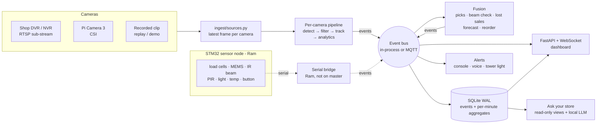
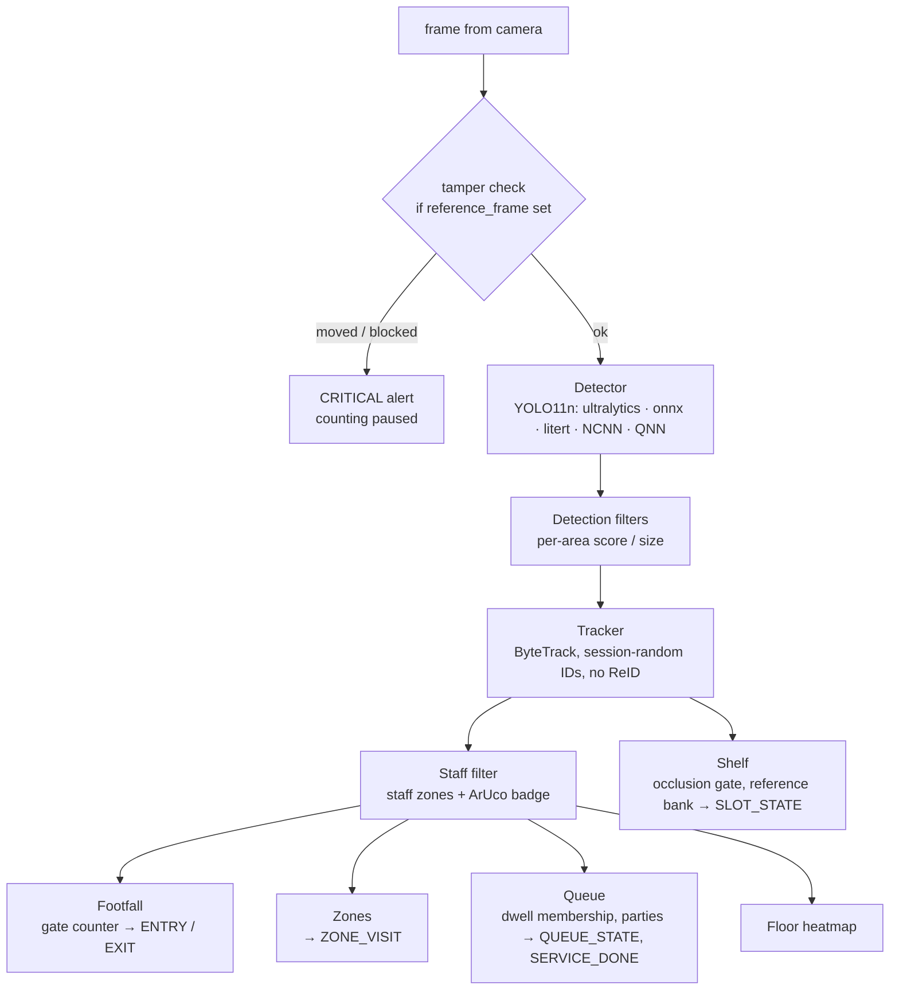
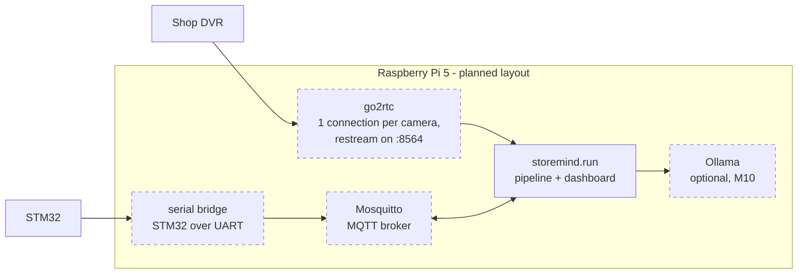

# Architecture

**Owner:** A (shared) · **Code:** `storemind/storemind/` · **Contracts:** docs/INTERFACES.md (events, MQTT),
docs/PROTOCOL.md (serial) · **Research:** research/04_ARCHITECTURE.md, research/23 §2

This page describes the code **on master today**. Parts that are built but not yet connected, or not built
yet, are drawn with dashed lines and listed in section 5.

## 1. The big picture

Three rules hold the design together:
1. **Modules talk only through events** (`core/events.py`, schema v2, pydantic, unknown fields rejected). A
   camera engine never calls fusion, and fusion never calls the database. They publish and subscribe. That is
   why the STM32 simulator, a replay file and a live sensor are interchangeable.
2. **No frame leaves memory.** Frames go through the pipeline and are dropped. Only events are stored (section 4
   and docs/PRIVACY_DPDP.md).
3. **Nothing is hard-coded per store.** Cameras, lines, lanes, slots and thresholds live in one YAML file
   (docs/CONFIG_REFERENCE.md), drawn with `tools/calibrate.py`.

## 2. What happens to one frame

- Frames are processed at the camera's `fps` (default 8). Shelf cameras take one frame every `shelf_period_s`
  (default 30 s), or at once when a MEMS "touch → settled" episode asks for it (M6).
- Staff are removed from every customer number, but the shelf occlusion gate still sees them: a staff member
  blocks the shelf like anyone else.
- In **replay** mode a single `VideoClock` always takes the camera with the earliest pending frame. That makes a
  replay byte-for-byte repeatable, which is what RESULTS.md depends on. In **live** mode (`--live`) the wall
  clock is used.

## 3. Fusion: where cameras and sensors meet

| engine | listens to | publishes | doc |
|---|---|---|---|
| `fusion/interaction.py` | SHELF_MOTION, WEIGHT, PRESENCE, ZONE_VISIT, CAMERA_MOUNT | PICKUP (pick / put-back / touch, units), SHRINK_FLAG, alerts | MEMS.md |
| `fusion/beam.py` | BEAM_CROSS, ENTRY, EXIT, CAMERA_HEALTH | camera-vs-beam agreement; ENTRY / EXIT from the beam when the camera is down | COUNTING.md |
| `fusion/fusion.py` | SLOT_STATE, SENSOR, ZONE_VISIT | LOST_SALE_RISK; the v1 weight-only PICKUP / SHRINK_FLAG | SHELF.md |
| `fusion/forecast.py` | ENTRY, checkout arrivals | FORECAST ("open counter 2 in ~6 min") | QUEUE.md |
| `analytics/promo.py` | customer tracks (per frame), PICKUP | PROMO_STATE (passers-by, stoppers, dwell, picks per promo zone per window) | PROMO.md |
| `analytics/reorder.py` | SLOT_STATE | reorder drafts | SHELF.md |
| `store/db.py` (Ram) | every event | SQLite rows + per-minute aggregates | INTERFACES.md |
| `alerts/manager.py` (Ram) | alert requests | ALERT (cooldown, escalation, voice en/hi/te) | - |

## 4. Storage and the dashboard

- **SQLite in WAL mode** (`store/db.py`): table `events` (one JSON row per event), `agg_minute` (per-minute
  totals for charts), `config`, `alerts_ack`, `sync_outbox`. Raw events expire after `storage.retention_days`
  (30); aggregates are kept. A background writer thread keeps disk latency off the camera loop.
- **Dashboard** (`api/server.py`, Ram): FastAPI + WebSocket on port 8000: live state, event feed, time series,
  heatmap, alert acknowledge, restock button.
- **MQTT** (`core/bus.py`, optional): topic `storemind/{store}/{node}/{cam}/{TYPE}`, a retained `status` topic
  with a Last Will (a dead node shows as offline), commands on `storemind/{store}/{node}/cmd/{command}`. With
  `mqtt.enabled: false` the same bus runs in-process, which is how the laptop demo works.
- **Ask your store / daily summary** (`llm/`, M10): reads the database through read-only views; the local LLM
  (Ollama) only writes SQL (docs/ASK.md).

## 5. Process layout

**Today on master:** one Python process, `python -m storemind.run`, with threads: one reader per live camera,
the SQLite writer, and the dashboard server when `--api` is given.

What is built but not connected, or not built yet. Each item is Ram's unless marked:
- **go2rtc restream, stream watchdog, PIR wake-up** (`ingest/go2rtc.py`, `watchdog.py`, `pir_wake.py`,
  `rtsp_reader.py`, `wiring.py`; M2). Built and tested, but `run.py` does not start `IngestManager` yet: the
  pipeline opens cameras with `ingest/sources.py`.
- **Serial bridge + STM32 simulator + firmware** (M5/M6-firmware): not on master. Until then the sensor events
  come from `eval/sensor_sim.py` (tests and evaluation only).
- **systemd units, install script, Pi setup** (M7/M8-deploy, `deploy/pi5/`): not on master.
- **Qualcomm board** (Person A, M9): code paths `litert_qnn` / `ort_qnn` exist, port guide in
  `deploy/qualcomm/README.md`; not run on hardware.

## 6. Module map

| path | owner | what |
|---|---|---|
| `core/` | shared (contract) | events, bus, config, geometry, clocks |
| `ingest/` | Ram | camera sources, go2rtc, URL templates, watchdog, PIR wake-up |
| `inference/` | Vinith | detector backends (incl. QNN), detection filters, exports, cached detections |
| `tracking/` | Vinith | tracker wrapper (ByteTrack, OC-SORT, BoT-SORT without ReID, SORT) |
| `analytics/` | Vinith | footfall, zones, queue, shelf, staff, heatmap, reorder |
| `fusion/` | Vinith | shelf interaction, beam cross-check, lost sales, forecast |
| `llm/` | Vinith | Ask your store, daily summary |
| `sensors/` | Ram | serial protocol (bridge to come) |
| `store/`, `api/`, `alerts/`, `health/` | Ram | SQLite, dashboard, alerts, health + tamper |
| `eval/` | Vinith | every evaluation and RESULTS.md (docs/EVALUATION.md) |
| `pipeline.py`, `run.py` | shared (contract) | wiring and CLI |

Ownership rules: research/26 §1 and CLAUDE.md.
