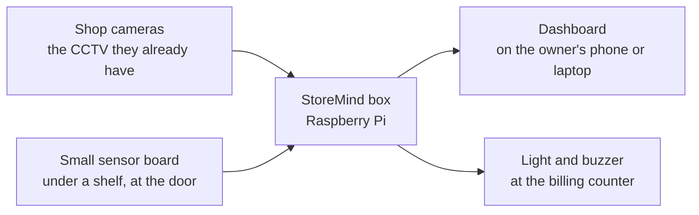

# Team guide

**Owner:** B (Ram), with section 2 by Vinith · **For:** teammates who don't code

A simple-English guide to what StoreMind does, how to switch it on, and how to read what it says.

## 1. StoreMind in one picture

The box watches the cameras, counts people, watches the queue and the shelves, and warns the shop owner. It
works without internet. It does not record video and does not recognise faces.

## 2. What the cameras measure, and how to read the numbers (Vinith)

**Door counter.** A line is drawn across the door on the camera picture. When a person crosses it inwards,
"entries" goes up by one; outwards, "exits" goes up. Inside now = entries − exits.
- It can miss or double-count people who walk in a tight group or stop on the line. On a public test video it got
  97 of every 100 entries right but only 76 of every 100 exits, so treat it as a good estimate, not an exact
  count.
- The sensor board's light beam across the door checks the camera. If the two disagree a lot, the dashboard asks
  someone to check the door camera.

**Queue.** A person is "in the queue" only if they stand in the queue lane for about 3 seconds and move slowly.
Someone walking past is not counted. People who arrive together are also shown as one group ("parties"), since
a family pays once.
- "Wait" is how long people stood in the queue before billing; "service" is how long billing took.
- "Open another counter" appears *before* the queue gets long: the box learns how long shoppers take to walk
  from the door to the counter.

**Shelves.** After a shelf is filled, someone presses **Restocked**. The box remembers how the full shelf looks.
Later it compares the shelf with that picture and says FULL, LOW or EMPTY for each slot.
- When it is too dark, or a person is standing in front of the shelf, it says **UNKNOWN**. That means "I can't
  see", not "empty".
- A weighing scale under the shelf (sensor board) tells picks from put-backs, in packs.

**Ask your store / daily summary.** The owner gets a short summary each day in English, Telugu or Hindi. They
can also type a question like "How many people came in today?". The answer always shows where its numbers came
from. It is right about 2 times in 3 on new questions, so if an answer looks odd, check the query shown under it.

**Words you will see**

| word | means |
|---|---|
| entry / exit | someone crossed the door line inwards / outwards |
| occupancy | people inside now (entries − exits) |
| queue length | people waiting at a billing counter |
| wait / service time | minutes waiting / minutes being billed |
| LOW / EMPTY / UNKNOWN | shelf slot running low / empty / can't see it right now |
| lost-sale risk | a shopper looked at an empty shelf: an *estimate* of money missed |
| tamper alert | a camera was moved or covered: counting stops until it is fixed |

**What it never does:** store video (the dashboard shows "Video stored: 0 bytes"), recognise faces, or follow a
person from one day to the next.

## 3. Switching it on (Ram fills in)

> **Ram:** power-on order, what the lights on the box and the sensor board mean, how to open the dashboard on a
> phone, with photos.

## 4. When a light is red (Ram fills in)

> **Ram:** each alert and what to do (camera offline, sensor board offline, camera moved, too dark, queue long),
> with photos. Link docs/TROUBLESHOOTING.md.
