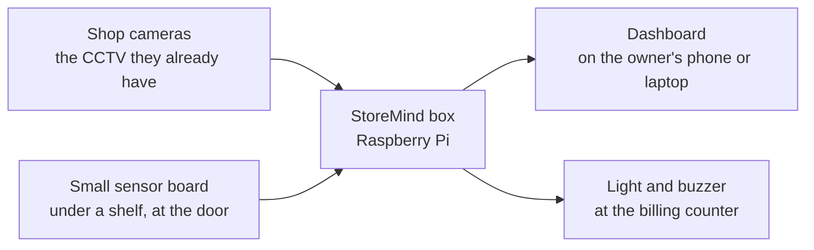

# Team guide

**Owner:** B (Ram), with section 2 by Vinith · **For:** teammates who don't code

A simple-English guide to what StoreMind does, how to switch it on, and how to read what it says.

## 1. StoreMind in one picture

The box watches the cameras, counts people, watches the queue and the shelves, and warns the shop owner. It
works without internet. It does not record video and does not recognise faces.

## 2. What the cameras measure, and how to read the numbers (Vinith)

**Door counter.** A line is drawn across the door on the camera picture. When a person crosses it inwards,
"entries" goes up by one; outwards, "exits" goes up. Inside now = entries − exits.
- It can miss or double-count people who walk in a tight group or stop on the line. On a public test video it got
  97 of every 100 entries right but only 76 of every 100 exits, so treat it as a good estimate, not an exact
  count.
- The sensor board's light beam across the door checks the camera. If the two disagree a lot, the dashboard asks
  someone to check the door camera.

**Queue.** A person is "in the queue" only if they stand in the queue lane for about 3 seconds and move slowly.
Someone walking past is not counted. People who arrive together are also shown as one group ("parties"), since
a family pays once.
- "Wait" is how long people stood in the queue before billing; "service" is how long billing took.
- "Open another counter" appears *before* the queue gets long: the box learns how long shoppers take to walk
  from the door to the counter.

**Shelves.** After a shelf is filled, someone presses **Restocked**. The box remembers how the full shelf looks.
Later it compares the shelf with that picture and says FULL, LOW or EMPTY for each slot.
- When it is too dark, or a person is standing in front of the shelf, it says **UNKNOWN**. That means "I can't
  see", not "empty".
- A weighing scale under the shelf (sensor board) tells picks from put-backs, in packs.

**Ask your store / daily summary.** The owner gets a short summary each day in English, Telugu or Hindi. They
can also type a question like "How many people came in today?". The answer always shows where its numbers came
from. It is right about 2 times in 3 on new questions, so if an answer looks odd, check the query shown under it.

**Words you will see**

| word | means |
|---|---|
| entry / exit | someone crossed the door line inwards / outwards |
| occupancy | people inside now (entries − exits) |
| queue length | people waiting at a billing counter |
| wait / service time | minutes waiting / minutes being billed |
| LOW / EMPTY / UNKNOWN | shelf slot running low / empty / can't see it right now |
| lost-sale risk | a shopper looked at an empty shelf: an *estimate* of money missed |
| tamper alert | a camera was moved or covered: counting stops until it is fixed |

**What it never does:** store video (the dashboard shows "Video stored: 0 bytes"), recognise faces, or follow a
person from one day to the next.

## 3. Switching it on (Ram)

**What is in the box:** the Raspberry Pi (the "brain"), the small sensor board (a blue STM32 board with wires to
the shelf and the door), and the tower light with a buzzer at the billing counter.

**Power-on order** (takes about 2 minutes):

1. The shop's Wi-Fi router or the phone hotspot we use.
2. The Raspberry Pi: its own black USB-C charger (27 W). A green light flickers on the Pi while it starts.
3. The sensor board gets its power from the Pi, so it starts by itself.
4. Wait 2 minutes, then open the dashboard (below).

**The lights and what they mean:**

| light | where | means |
|---|---|---|
| small light blinking **once a second** | on the sensor board | the sensor board is healthy |
| that light **always on or always off** | on the sensor board | it is stuck: unplug its cable from the Pi for 5 seconds and plug it back |
| tower light **off** | at the counter | nothing needs attention |
| tower light **slow blink** | at the counter | something to look at soon (shelf low, queue building, a sensor went quiet) |
| tower light **fast blink** | at the counter | act now (queue full, stock may have fallen) |
| tower light **three quick flashes, again and again**, often with a beep | at the counter | urgent (after-hours movement, shelf tilted, camera moved, shelf empty) |

The buzzer stops by itself after 5 seconds. The light goes off when every alert on the dashboard has been
acknowledged.

**Opening the dashboard on a phone:**
1. Connect the phone to the same Wi-Fi as the box.
2. Open the browser and type `storemind.local:8000`. If it does not open (some Android phones), use the box's
   number instead, for example `192.168.1.50:8000`: it is written on the label on the box.
3. Add it to the home screen, so next time it is one tap.

Photos to add before the event: the box with its cables, the sensor board with the blinking light circled, the tower
light in each state, and the dashboard on a phone. **Not taken yet: the hardware is not assembled.**

## 4. When a light is red (Ram)

On the dashboard every problem appears in **Alerts**, with a short message. Press **acknowledge** once you have dealt
with it: the tower light goes off when nothing is left.

| you see | it means | do this |
|---|---|---|
| a camera **red** in the Cameras panel | no picture from that camera | check its cable and power; for the shop's CCTV, check the DVR is on. It comes back by itself |
| a camera **amber** | it is reconnecting, or the picture is too dark | wait a minute; if it stays amber, switch the light on or check the camera |
| "Camera … moved or blocked" | someone knocked or covered the camera | put it back where it was (the marks on the wall help); tell Ram, the door line may need redrawing |
| "Camera … was bumped" / "tilted" | the camera's sensor felt a knock | look at the picture: if it looks the same, just acknowledge |
| "Sensor node … silent" / sensor panel **red** | the sensor board stopped talking | check its cable to the box; unplug and plug it back. It reconnects by itself |
| "…is OUT OF STOCK" / "running low" | a shelf slot is empty / low | refill it, then press **Mark restocked** for that shelf |
| slot says **UNKNOWN** | the box cannot see that slot (dark, or someone standing in front) | nothing: it is not "empty". Switch the light on if it is dark |
| "Stock may have fallen" | the shelf was knocked and weight went missing | look on the floor near that shelf |
| "Shelf … has tilted" | the shelf is leaning | check it is safe before anyone uses it |
| "…queue …" / "Open another counter" | the queue is long, or will be soon | open another billing counter |
| "Motion after hours" | the movement sensor saw someone while the shop is closed | check the shop; if it was staff, acknowledge |

More (for whoever fixes it): docs/TROUBLESHOOTING.md.
