# How to read this document

This document explains the complete StoreMind system: every software module and every hardware part. It is written
for three kinds of reader:

- **Team members**, who need to understand and explain every part.
- **Faculty and students**, who want to know how the system works and why it was built this way.
- **Technical reviewers**, who want to find weak points and suggest improvements. Chapter 11 lists the questions
  where suggestions would help most.

Each module section follows the same pattern: what it does, its inputs and outputs, how it works step by step, the
important settings with their default values, why this approach was chosen, its limits, and its status.

## Status labels

Every part carries one of four status labels. They describe the code on the `master` branch of the repository on the
date above, plus work that exists on unmerged branches.

| Label | Meaning |
|---|---|
| **Working and tested** | The code is on `master`, the main program uses it, and automated tests pass. This does **not** mean it has been proven in a real shop; see the data labels below. |
| **Built, not yet connected** | The code is on `master` and tested on its own, but the main program does not start or use it yet. |
| **In progress** | Code exists but is not finished or not merged into `master` (for example, it is on a branch waiting for review). |
| **Designed, not yet built** | The design is written down (in `docs/` or `research/`), but no code exists yet. |

## Data labels (A, B, C, S, Q, P)

Every measured number in this document comes from the generated results file
`storemind/storemind/eval/results/RESULTS.md`, and every number carries a letter that says what kind of data produced
it. The letters matter: a number from a simulation can show that the logic is correct, but it cannot show that the
system works in a real shop.

| Label | Data | What the number can be used for | What it can **not** be used for |
|---|---|---|---|
| **A** | Public benchmark video with published correct answers (the CAVIAR dataset) | Real accuracy, with the warning that it is not an Indian store | Claims about a real kirana |
| **B** | Our own recordings, labelled by hand | Real accuracy | Nothing yet: **there is no B data yet** |
| **C** | Simulation, where the correct answer is known exactly | Showing that the logic is correct | Any accuracy claim |
| **S** | Real video or a real device, but no correct answers | Speed, power, temperature | Accuracy |
| **Q** | A Qualcomm AI Hub device hosted by Qualcomm | Qualcomm chip speed and NPU use | "Our own board" |
| **P** | A figure published by someone else (cited) | Background context | Our own measurement |

A term shown in **bold** the first time it appears is also defined in the Glossary (chapter 13).

# 1. What StoreMind is and the problem it solves

## 1.1 The problem

India has millions of small shops (kiranas), pharmacies and supermarkets. The problem statement (Smart India Hackathon
2026, problem 26179, from Qualcomm) lists their everyday problems:

- **Empty shelves go unnoticed.** A shopper looks for a product, finds an empty slot and leaves. The owner learns about
  it later, if at all.
- **Billing queues grow before anyone reacts.** Staff open a second counter only after the queue is already long.
- **Owners know little about shopper behaviour.** How many people came in, when the rush starts, which displays
  attract people.
- **The internet is unreliable.** Many stores in Tier-2 and Tier-3 towns cannot depend on cloud services.
- **Privacy matters.** Shoppers should not be recorded or identified.

## 1.2 What StoreMind does

StoreMind is a small computer (a **Raspberry Pi 5**) placed in the shop. It watches the shop's existing CCTV cameras,
or a cheap Pi camera, and reads a small sensor board (an **STM32** microcontroller with weighing scales, motion
sensors and light sensors). It turns what it sees and measures into simple facts and alerts:

| Question the owner has | What StoreMind reports |
|---|---|
| How many people came in, and when? | Entries and exits per hour, people inside now, busiest hour |
| Where do shoppers spend time? | Time spent in each zone (for example a promotion display), a floor heatmap |
| Is a shelf empty? | Each shelf slot as FULL, LOW, EMPTY, WRONG ITEM or UNKNOWN, with the reason |
| Did someone take something? | Picks and put-backs from the weighing scale under the shelf, counted in packs |
| Is the billing queue too long? | People waiting, waiting time, service time per counter |
| Should another counter open? | A recommendation **before** the queue forms, with the expected time |
| Anything unusual? | Alerts: camera moved or covered, motion after closing time, stock fallen, sensor offline |
| A question in plain words | "How many people came in today?" answered from the shop's own data |

Everything runs **inside the shop**. No video is stored, no face is recognised, and no internet is needed.

## 1.3 What makes it different, in one paragraph

Large retailers already use products like this, but with expensive dedicated sensors and cloud services. StoreMind
aims to do the same jobs with the cameras a shop already has, a box whose parts are estimated at roughly
₹15,000–25,000 (a design estimate from research/03, not a measured figure), and no internet. It connects three signals that are usually separate: who walks in, what happens at the shelves, and how
long people wait to pay. Chapter 8 compares it with existing products and research honestly.

# 2. The whole system in one picture

## 2.1 The parts

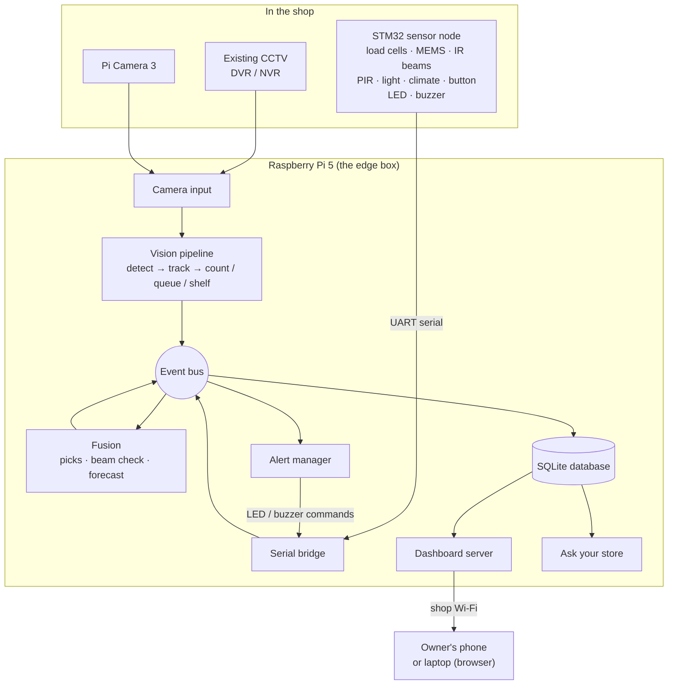

*Figure 2.1: The complete system. Everything inside the "Raspberry Pi 5" box runs on the Pi. The phone only opens a
web page served by the Pi over the shop's own Wi-Fi. The sensor node and the serial bridge are in progress
(chapter 4).*

## 2.2 How data flows, step by step

The key idea: **video never leaves the Pi and is never saved**. Each frame is analysed in memory and then thrown
away. What travels onwards is a small text message called an **event**, for example "a person entered at 18:04:12".

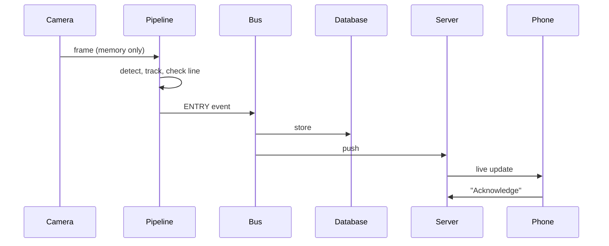

*Figure 2.2: From a camera frame to the owner's phone. The live update is a WebSocket push, with a full refresh
every 3 s. A sensor reading follows the same path, starting from the serial bridge instead of the vision pipeline.*

1. **Camera input** reads the newest frame from each camera, at a rate set per camera (for example 8 frames per
   second at the door, one frame every 30 seconds for a shelf).
2. The **vision pipeline** finds people in the frame, follows each person from frame to frame, and checks rules:
   did someone cross the door line, join a queue, stand at a shelf?
3. When a rule fires, the pipeline publishes an **event** on the **event bus**, a message system that delivers
   each event to every module that wants it.
4. The **serial bridge** does the same for the sensor board: each serial line from the STM32 becomes an event.
5. **Fusion** modules combine events: a weight change plus a shelf touch becomes a "pick"; door counts become a
   queue forecast.
6. The **database** stores every event and keeps per-minute totals for charts.
7. The **alert manager** turns important events into alerts: a console line, a sound, a spoken sentence, or the
   LED and buzzer on the sensor board.
8. The **dashboard server** serves a web page to the owner's phone and pushes new events to it live.

## 2.3 One program or several?

Today the main program `python -m storemind.run` is **one process**: one running program with several threads (one
per live camera, one for database writes, one for the dashboard server). The planned layout on the Pi splits it
into several processes that talk over **MQTT** (section 3.9): camera restreaming, the main pipeline, the serial
bridge, and the optional language model.

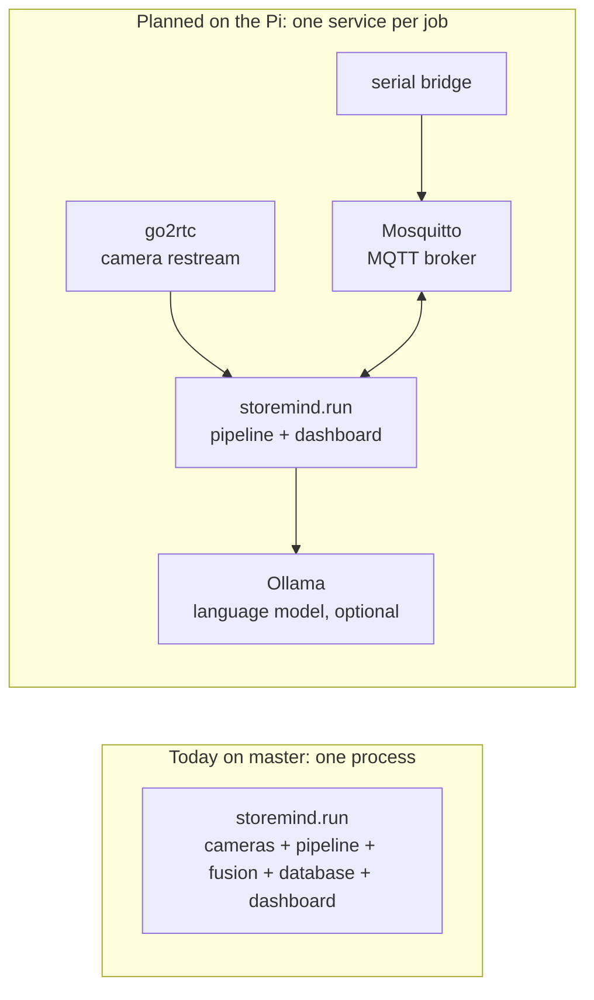

*Figure 2.3: Process layout today and as planned. The planned services are described in their own sections, with
their status.*

# 3. The software, part by part

All software is Python 3.11, in the folder `storemind/storemind/`. The firmware for the STM32 is C (chapter 4).

## 3.1 Camera input and CCTV connection

**What it does.** Gets frames from every camera into the pipeline without falling behind, and helps an installer
connect a shop's existing CCTV recorder.

**Inputs.** A camera "source" written in the configuration file: a video file, a USB camera number, an **RTSP**
address (the standard way CCTV recorders stream video over a network), an HTTP phone-camera address, or `csi:0` for
the Raspberry Pi camera. **Outputs.** Frames (images in memory) with a timestamp, and `CAMERA_HEALTH` events.

### 3.1.1 Frame sources (`ingest/sources.py`) — Status: working and tested

How it works:

- **Live cameras** run a background thread that reads frames continuously and keeps **only the newest one**. OpenCV
  buffers RTSP frames internally; a simple reader falls seconds behind reality, which would make every queue timer
  wrong.
- **Video files** are read one frame after another, with **no frames dropped**. Dropping frames during a replay would
  make the same video give a different result on every run, and then no measurement could be repeated.
- RTSP is forced onto TCP, which is more reliable than UDP on shop networks.
- A per-camera scheduler (`FpsScheduler`) processes frames at the configured rate: `cameras[].fps`, default 8 frames
  per second, and one frame every `shelf_period_s` (default 30 s) for shelf cameras.
- The Raspberry Pi camera is read through the Picamera2 library, which is loaded only on the Pi.

### 3.1.2 Camera address templates (`ingest/urls.py`) — Status: working and tested

An installer should never have to type an RTSP address by hand. They give the brand, the IP address and the channel
number, and the module builds the address. Templates exist for Hikvision (and Prama, the same firmware), Dahua (and CP
Plus), TP-Link Tapo, Uniview and Reolink, plus the local test server. Every template chooses the **sub-stream** (the
recorder's small, low-resolution stream) by default. A Pi decoding four full-size main streams would overload.

### 3.1.3 go2rtc restream, stream watchdog and PIR wake-up — Status: built, not yet connected

Three modules are complete and tested, but the main program does not start them yet; `run.py` still opens cameras
directly through `sources.py`.

- **go2rtc gateway (`ingest/go2rtc.py`).** go2rtc is a small open-source program that keeps **one** connection to
  each camera and shares it locally at `rtsp://127.0.0.1:8564/<camera>`. Cheap DVRs refuse extra clients once their
  limit is reached, so the pipeline, the dashboard and snapshot tools must not each open their own connection. The
  generated go2rtc configuration contains camera passwords, so it is written to a git-ignored `runtime/` folder and
  never logged.
- **Stream watchdog (`ingest/watchdog.py`).** Tracks each camera as `starting → online ↔ stale → reconnect`, or
  `offline` if it cannot be opened. No frame for 5 s means **stale**. Reconnect attempts wait 1 s, then 2 s, 4 s and
  so on up to 30 s (**exponential backoff**), so a dead camera does not flood the network. Each state change becomes
  a `CAMERA_HEALTH` event.
- **PIR wake-up (`ingest/pir_wake.py`).** Cameras idle at 1 frame per second to save processing power. When the PIR
  motion sensor in a zone reports presence, that zone's cameras run at full rate for 30 s, and each new detection
  extends the time. A camera with no PIR sensor assigned always runs at full rate, so a missing sensor never blinds
  a camera.
- `ingest/wiring.py` (`IngestManager`) connects all three to the event bus. Starting it from `run.py` is the
  remaining step.

### 3.1.4 Installer tools — Status: working and tested

| Tool | What it does |
|---|---|
| `tools/discover.py` | Scans one shop subnet (with permission) for camera ports (554, 80, 443, 2020, 5543, 8000, 37777) and guesses the brand from which ports answer. It refuses ranges larger than 256 addresses. |
| `tools/probe.py` | Opens one stream and measures the **real** frame rate, resolution and lag. A recorder may claim 25 FPS and deliver 6; only the measured value matters. |
| `tools/fake_cctv.py` | Serves video files as RTSP "cameras" using MediaMTX and ffmpeg, so the complete camera path can be tested without real CCTV. |
| `tools/e2e_smoke.py` | Starts fake CCTV → go2rtc → reader; checks that the camera comes online, that a killed camera is detected, that it recovers, and that health messages never contain a password. |

**Designed, not yet built:** an ESP32-S3 battery shelf camera that sends a JPEG over MQTT every few minutes; an
image-difference "motion gate" in front of the detector; night/infrared mode detection; ONVIF WS-Discovery (the
discover tool uses a port scan instead).

**Why this approach.** Reusing existing CCTV is the biggest cost saving for a shop. Sub-streams, one connection per
camera, and newest-frame-only reading are the standard ways to keep a small computer from falling behind.

**Limits.** Tested with fake CCTV and recorded video only; no real shop recorder has been connected yet. The address
templates come from vendor documentation and must be confirmed on each device.

## 3.2 Person detection and model formats

**What it does.** Finds every person in a frame and returns a box around each one.

**Input.** A frame. **Output.** A list of **detections**: box position, a confidence score between 0 and 1, and the
class (person).

**How it works.**

1. The frame is **letterboxed**: resized to fit a square (640 × 640 pixels by default) without stretching, with
   grey padding. Stretching would make people look thinner or wider than they are and hurt accuracy.
2. The neural network **YOLO11n** (the "nano", smallest version of Ultralytics' YOLO11 detector) finds people.
3. Detections below the confidence threshold (default 0.35) are dropped, and overlapping duplicates are merged by
   **non-maximum suppression** (overlap threshold 0.5).
4. Only the "person" class (class 0 in the COCO label set) is kept.

The same detector can run in several formats, chosen by `detector.backend` in the configuration:

| Backend | Format | Where it is used | Status |
|---|---|---|---|
| `ultralytics` | PyTorch `.pt` (also NCNN) | laptop GPU for evaluation; NCNN is recommended for the Pi CPU | Working and tested |
| `onnx` | ONNX, FP32 or INT8 | portable CPU inference | Working and tested |
| `litert` | TensorFlow Lite (LiteRT) | CPU, including the Qualcomm-compiled INT8 model | Working and tested |
| `litert_qnn` | TFLite + Qualcomm QNN delegate | Qualcomm Hexagon NPU | Built, not yet connected (no Qualcomm board yet) |
| `ort_qnn` | ONNX Runtime + QNN execution provider | Qualcomm Hexagon NPU | Built, not yet connected (no Qualcomm board yet) |
| `scripted` | saved detections (JSON) | replaying synthetic test videos with perfect detections | Working and tested |
| `stub` | none | tests; sees nothing | Working and tested |

Important settings: `detector.model` (default `yolo11n.pt`), `detector.imgsz` (640), `detector.conf` (0.35),
`detector.iou` (0.5), `detector.num_threads` (4), and `cameras[].infer_size`, which gives one camera its own input
size (for example 416 for a small entrance stream).

Every detector reports which hardware is really running it, for example `qnn-htp` or
`cpu (fallback: <reason>)`. The setting `require_accelerator: true` makes the program refuse to start on the CPU
when an NPU was expected, so a demonstration can never claim NPU use that did not happen.

**Why YOLO11n.** It is small (5.61 MB [S]) and light enough for a Raspberry Pi, and it can be exported to every
format above. A larger model (YOLO11s) tracked people better in the evaluation, but it needs about three times the
computation and ran below the 8 frames per second needed at the door on the laptop CPU (docs/COUNTING.md), so it is
kept for the Qualcomm NPU (chapter 5).

**Limits.** Trained on general photos (COCO), not Indian shops. Small, distant or heavily overlapping people are
missed. Speed on the Raspberry Pi 5 has not been measured yet.

## 3.3 Tracking — Status: working and tested

**What it does.** Follows each detected person from frame to frame and gives them a **track number**, so that "the
same person" can be recognised across frames without knowing who they are.

**Input.** Detections for one frame. **Output.** **Tracks**: a track number, a box and a confidence value for each
person.

**How it works.** The default tracker is **ByteTrack**. For every existing track, a **Kalman filter** (a standard
prediction method) predicts where the box should be in the new frame. New detections are matched to predictions by
box overlap (**IoU**, intersection over union). ByteTrack's special step is a second matching round with
*low-confidence* detections, which recovers people who are partly hidden. A track that is not matched is kept for 30
frames (`lost_track_buffer`) in case the person reappears.

Alternatives available through `tracker.type`: OC-SORT, BoT-SORT (without its appearance model), SORT, and a simple
built-in tracker for tests. All come from the open-source `trackers` library (Apache-2.0 licence).

Two details matter:

- **Only confirmed tracks are used.** The library marks new, unconfirmed tracks with the same placeholder number;
  treating them as a person made one queue of 7 look like 14 arrivals.
- **Track numbers are session-random.** Each run adds a secret random offset (between one million and one billion,
  drawn with Python's `secrets` module) to every track number. Without it, "track 17" would mean "the 17th person
  today" every day, and numbers could be lined up across days.

**Why no appearance-based re-identification.** Re-identification recognises a person by their clothes and body. It
would help tracking, but it creates a biometric-like signature, which the privacy rules forbid. Tracking by motion
only is both cheaper and safer.

**Limits.** When two people cross closely, their track numbers can swap (an **ID switch**). The queue module
repairs some of these (section 3.6).

## 3.4 Door counting (entries and exits) — Status: working and tested

**What it does.** Counts people entering and leaving through a door, from a camera that looks at the door.

**Inputs.** Tracks, and a door line drawn once on the camera image with the calibration tool. **Outputs.** `ENTRY`
and `EXIT` events. Each carries the line name, the track number and the direction.

**How it works.** Each person is represented by their **foot point**: the middle of the bottom edge of their box,
roughly where they stand. Two counting modes exist (`line.mode`):

- `single`, the first version: crossing the line (with a small margin) counts.
- `gate`, used in the demonstration configuration: a band `gate_px` wide is centred on the line, with edges A and B.
  A crossing counts only when the foot point goes from beyond A to beyond B, and only after the person stays on the
  far side for `confirm_s` (0.5 s). Stepping straight back cancels it.

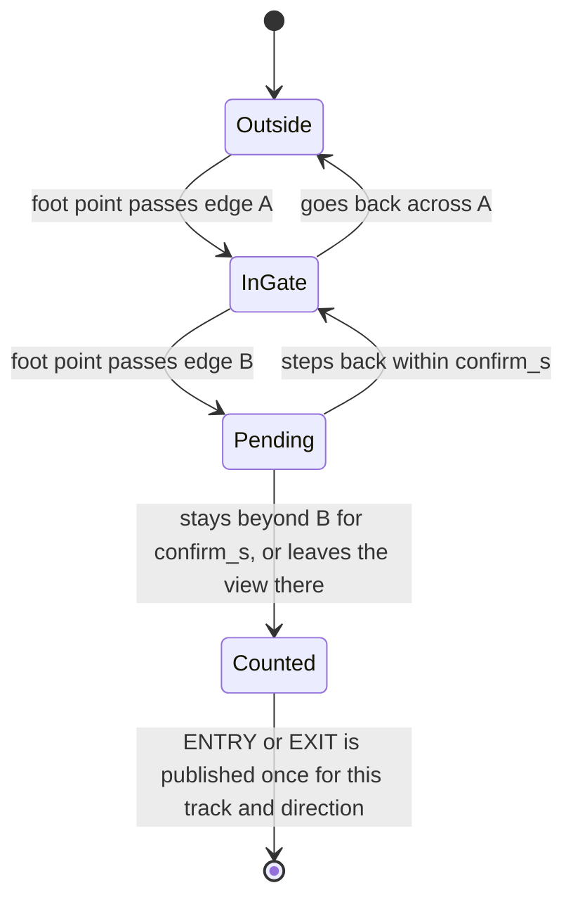

*Figure 3.1: The gate counter for one person.*

Extra rules: each track counts at most once per direction, and the same track cannot count again within `cooldown_s`
(3 s). Optional checks (minimum track age, minimum movement, direction angle) can be switched on per camera. Every
rejected crossing is counted by reason, so an installer can see why a count did not happen.

**Per-area detection filters** (`cameras[].filters`) run before tracking. They remove detections that are always
wrong in one place: a mannequin, a poster, a reflection in glass.

**Settings (defaults):** `line.mode` single (demo uses gate), `gate_px` 10, `confirm_s` 0.5, `cooldown_s` 3,
`entry_direction` pos, `direction_mode` off, `min_track_age_s` 0.

**IR-beam cross-check.** If two infrared beams are fitted across the door (chapter 4), the STM32 reports every
crossing with its exact time and direction. The fusion module (`fusion/beam.py`):

- matches each beam crossing to a camera crossing in the same direction within 2 s;
- reports **agreement = 2 × matched ÷ (beam crossings + camera crossings)** per door;
- raises "check entrance calibration" when agreement falls below 80% over the last 30 crossings (after at least
  10);
- **takes over counting** while the door camera is unhealthy, publishing ENTRY/EXIT marked as coming from the beam.

**Why this approach.** A single line double-counts people who hover on it. The gate plus confirmation removes most of
those cases. The beam gives an independent second count without identifying anyone, so camera problems become
visible.

**Results.** See section 7.3: on the public CAVIAR benchmark [A], entries are 96.7% correct but exits only 76.2%,
below the 90% target. Settings tuned on one camera view did not transfer to the other, which is why the beam is
planned as the per-shop calibration tool.

**Limits.** Groups walking shoulder to shoulder and people stopping in the doorway remain hard. The exit target is not
met. The beam cross-check is tested only with simulated beam events.

## 3.5 Staff exclusion — Status: working and tested

**What it does.** Removes shop staff from customer numbers (footfall, zone time, heatmap and queue) without
identifying who they are.

**Inputs.** Tracks and the frame. **Output.** A set of track numbers marked "staff" for this session.

**How it works.** A track becomes staff in either of two ways:

1. It stays inside a **staff zone** (behind the counter, the stock-room door) for `zone_dwell_s` (2 s).
2. The camera sees a printed **ArUco marker** on it. An ArUco marker is a black-and-white square code that OpenCV can
   read; staff wear one on a lanyard card. The marker is searched every 2nd processed frame (`badge_every_n`).

Only one yes/no flag is kept per track. The marker's number is used for the check and then forgotten. The shelf
module still sees staff, because a staff member standing in front of a shelf blocks the view like anyone else.

**Why.** Staff walk past the door and the counter all day, and without exclusion they inflate every number. Badges
are how commercial counters handle this; zones need no hardware at all.

**Limits.** A badge must be large enough and face the camera (at least 6 cm wide is recommended); this depends on
camera resolution and distance and must be checked on site.

## 3.6 Queue analysis and counter forecast

### 3.6.1 Queue analysis (`analytics/queue.py`) — Status: working and tested

**What it does.** For each billing counter, measures how many people are waiting, how long they wait, and how long
billing takes.

**Inputs.** Tracks (staff removed), and two areas drawn per counter: the **lane** where people wait and the
**billing area** where they pay. **Outputs.** `QUEUE_STATE` events every few seconds and a `SERVICE_DONE` event per
served customer.

| Output field | Meaning |
|---|---|
| `queue_len`, `queue_len_smooth` | people waiting; the smoothed value is the median of recent looks |
| `queue_parties` | groups: a family that queues and pays together counts once |
| `median_wait_s` | median time from joining the queue to the start of billing |
| `wait_littles_s` | the same wait estimated by **Little's law** (explained below) |
| `service_rate_per_min` (μ) | customers served per minute at this counter |
| `arrivals_per_min` (λ) | people joining per minute |
| `balks`, `reneges` | people who stopped and left without joining / joined and left before being served |
| `tail_overflow` | the queue has reached the end of its lane for 5 s |

**How it works.**

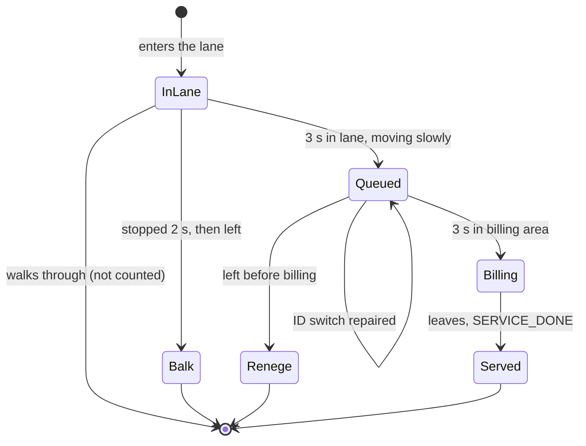

*Figure 3.2: The life of one person at a counter (`membership: dwell`).*

1. **Joining.** A person joins only after 3 s in the lane (`join_dwell_s`) while moving slower than 0.10 frame
   heights per second (`max_join_speed`). Their waiting time is then back-dated to when they entered the lane.
   People walking past are never counted as arrivals.
2. **Parties.** People who join within 4 s of each other (`party_join_window_s`) and stay within 0.06 frame heights
   of each other (`party_dist`) are grouped into one party.
3. **ID-switch repair (stitching).** If a track disappears mid-queue and a new track appears within 0.10 frame
   heights within 4 s, the new track takes over the old one's place and timer.
4. **Billing.** Service starts after 3 s in the billing area (`min_service_s`); shorter visits are ID flicker, not
   service. It ends when the person leaves the billing area. Timers survive short detection gaps of up to 2 s
   (`gap_tolerance_s`).
5. **Bent queues.** A lane can be a **polyline** (a line through the middle of the queue, listed from the billing
   end) with a width (`lane_width`, 0.12 frame heights), so an L-shaped queue around a shelf is followed exactly.
6. **Little's law cross-check.** Little's law says: average number waiting = arrival rate × average waiting time
   (L = λ × W). Over a 10-minute window (`littles_window_s`), W = L ÷ λ gives a waiting time **without following any
   individual**. It is shown next to the per-person median; a big difference between the two means tracking is
   struggling.

**Why dwell-based joining.** The first version counted everyone inside the lane area. People walking through were
counted as arrivals, which tripled the arrival rate that the forecast uses.

**Limits.** Balks and reneges cannot be separated reliably: with a 3 s join time, people who stop for 3–6 s and then
leave count as reneges. Only their sum, "walked away unserved", is usable. Per-person waits degrade when track numbers
switch often (section 7.3). No real shop queue has been recorded yet.

### 3.6.2 Counter forecast (`fusion/forecast.py`) — Status: working and tested

**What it does.** Recommends opening another billing counter **before** the queue forms.

**Inputs.** ENTRY events from the door camera; arrivals and service rates from the queue module. **Output.** A
`FORECAST` event every minute, for example "2 counters recommended, extra counter needed in about 6 minutes".

**How it works.**

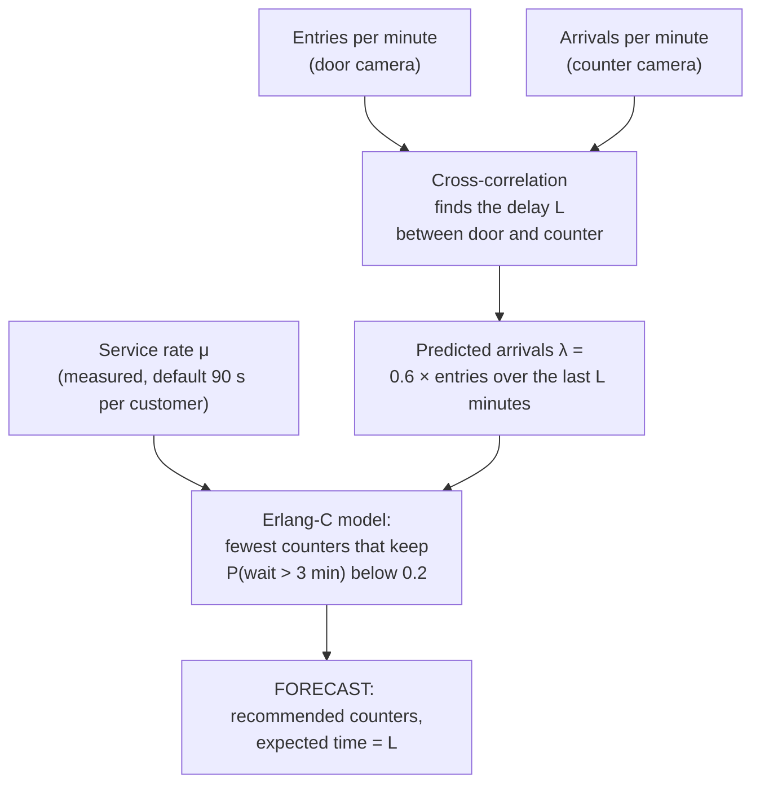

*Figure 3.3: The counter forecast.*

1. **Learn the shopping-trip delay.** People who enter now reach the counter about one shopping trip later. The
   module compares the per-minute entry count with the per-minute counter-arrival count at every delay from 1 to 40
   minutes (**cross-correlation**) and picks the best match. It compares two counts; no person is followed between
   cameras.
2. **Predict arrivals.** λ = `conversion` (0.6, the share of visitors who buy) × average entries over the last L
   minutes. Before a delay is known, the recent counter arrival rate is used.
3. **Recommend counters.** The **Erlang-C** formula, a standard queueing formula for c servers, gives the
   probability that a customer must wait. The module finds the smallest number of counters for which the chance of
   waiting more than `target_wait_min` (3 minutes) is below `max_prob_over_target` (0.2).
4. **Warm-up.** For the first 3 minutes (`warmup_min`) the forecast is published but never asks for extra staff. An
   older version turned one person in a queue into a forecast of 78.

**Why this approach.** Erlang-C is simple, explainable and needs no training data. The delay is learned
automatically, so each shop needs no manual setup.

**Limits.** Erlang-C assumes random (Poisson) arrivals, random service times and no people leaving the queue. A
kirana does not exactly behave like this, so the output is a staffing suggestion. The forecast is tested only in
simulation [C].

## 3.7 Shelf monitoring — Status: working and tested (real-shelf test pending)

**What it does.** Tells, for each shelf slot, whether it is FULL, LOW, EMPTY, holds the WRONG ITEM, or is UNKNOWN
(the camera cannot see it properly). It gives the reason every time.

**Inputs.** Shelf camera frames, slot outlines drawn once with the calibration tool, the "Restocked" button, and
optionally light readings (BH1750 sensor) and weights (load cells). **Outputs.** `SLOT_STATE` events with state,
fill level, confidence and a readable reason, for example `fill 0.12 <= empty 0.28; lux 140`.

**How it works.** The method needs **no training and no product model**:

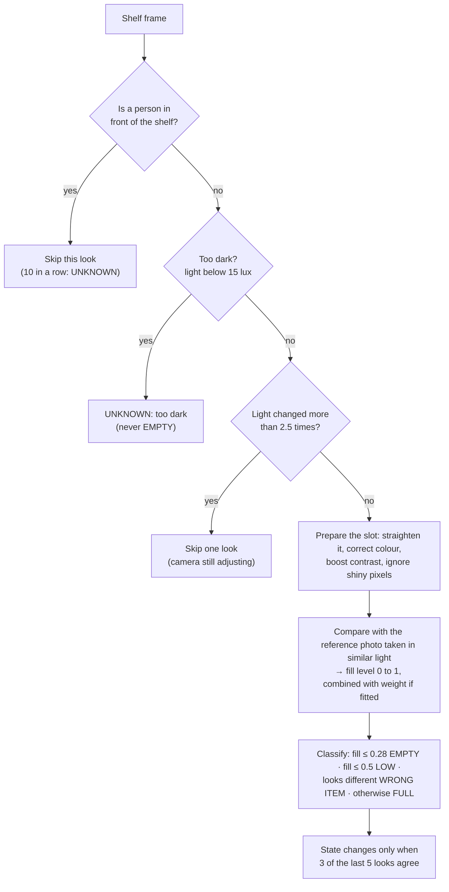

*Figure 3.4: One look at one shelf slot.*

1. After a restock, a staff member presses **Restocked** (on the dashboard or the sensor board). The module saves a
   **reference** photo of each slot.
2. At every look it first checks for a person in front of the shelf (the **occlusion gate**). If someone overlaps
   the shelf, the look is skipped.
3. It compares the slot with its reference. Packets have printed texture and edges; an empty slot shows a flat back
   panel. The **fill level** comes from texture strength divided by local brightness (so it does not depend on light
   level), combined with a structural-similarity score (30% weight).
4. **WRONG ITEM**: the slot is full but its colours do not match the reference.
5. **K-of-N voting:** the state changes only when 3 of the last 5 looks agree (`vote_k`, `vote_n`), so one bad look
   cannot raise an alert.

**Handling real lighting (version 2).** The first version compared edge counts with one reference photo; evening
light and dim corners made full shelves look empty. Version 2 adds:

| Problem | Fix |
|---|---|
| Warm evening light and cool tube lights change colours | **Gray-world white balance**: assumes the walls and shelf boards are grey on average and corrects the colour cast |
| Less light gives fewer edges | Texture divided by local brightness |
| Low contrast in dim light | **CLAHE**, a contrast boost that works on small regions |
| Shiny packets reflect lights | Very bright, colourless pixels are ignored |
| One reference cannot match every lighting | Up to 4 references per slot, one per lighting, chosen by the BH1750 light reading (or frame brightness) |
| Lights switched off | Below 15 lux the slot is UNKNOWN "too dark", never EMPTY |
| Camera looks at the shelf from an angle | 4-point slots are warped to a rectangle |
| Deep shelves: only the front row is visible | Load-cell weight is fused: weight wins for deep slots; a big disagreement adds "CHECK SHELF: camera X vs weight Y" |

**Actions.** EMPTY or LOW opens a reorder draft (kept locally as ready-to-send WhatsApp text; nothing is sent
automatically), and FULL closes it. If shoppers linger in front of an EMPTY or LOW slot, a `LOST_SALE_RISK` event
estimates the rupees at risk (time spent × price). It is always labelled an estimate.

**Settings (defaults).** `empty_threshold` 0.28, `low_threshold` 0.5, `vote_k` 3, `vote_n` 5, `reference_bank` 4,
`dark_lux` 15, `lux_jump_ratio` 2.5, `occlusion_iou` 0.05, `disagree_fill` 0.4, `shelf_period_s` 30.

**Why reference photos instead of a product detector.** A product detector must be trained on the products of each
shop and needs a stronger computer. A reference photo works on day one with any product. An optional product-detector
mode (`shelf.method: detector` or `hybrid`) is wired in and tested with a fake detector, but no product detector has
been trained, so it is **designed, not yet built** as a working feature.

**Limits.** Tested only on simulated shelves [C]. The real acceptance test (empty-slot F1 at least 0.85 in day and
evening light on own photos) has not been run. The light sensor showed no benefit in simulation, because simulated
light is perfectly uniform.

## 3.8 Sensor fusion: picks, tamper and after-hours — Status: working and tested (hardware not yet connected)

**What it does.** Combines the camera with the STM32 sensors to answer questions a camera alone cannot: how many packs
were taken, whether a shelf was only touched, whether stock fell, whether a camera was knocked, whether someone moved
inside after closing.

**Inputs.** `WEIGHT` (load cell), `SHELF_MOTION` (MEMS on a shelf), `CAMERA_MOUNT` (MEMS on a camera bracket),
`PRESENCE` (PIR) and `ZONE_VISIT` events, plus the image tamper check. **Outputs.** `PICKUP` events (pick, put-back
or touch, with a pack count), `SHRINK_FLAG`, and alerts.

**The core idea.** A load cell (a weighing sensor under the shelf) gives wrong readings while a hand is on the shelf.
A **MEMS accelerometer** (a tiny chip that measures vibration and tilt) under the shelf reports when a touch starts
(`TOUCH`) and when the shelf is still again (`SETTLED`). The fusion module trusts only the weight measured around
`SETTLED`.

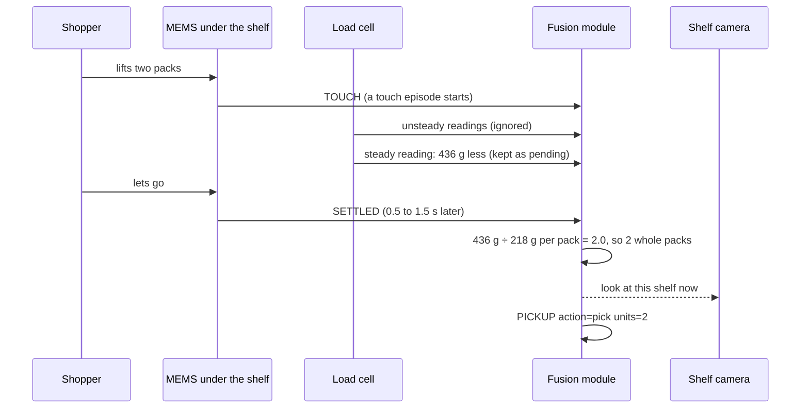

*Figure 3.5: A pick. The steady new weight often arrives before SETTLED, so it is held as "pending" and thrown away
if an unsteady reading follows.*

| Situation | Evidence | Result |
|---|---|---|
| Shopper takes packs | TOUCH → SETTLED; weight drop close to whole packs (within 25%) | PICKUP pick, number of packs |
| Shopper puts one back | same, weight rise | PICKUP put_back |
| Handles and puts down | TOUCH → SETTLED, no weight change, shopper present | PICKUP touch (interest, no stock change) |
| Trolley knocks the shelf | KNOCK, then weight dropped | alert "stock may have fallen" (never a pick) |
| Shelf tilts | TILT | alert "shelf tilted" |
| Weight drops, no touch, nobody there | two agreeing steady readings | SHRINK_FLAG (possible theft or fall) |
| No MEMS fitted | two agreeing steady readings with a shopper present | pick or put-back marked "weight only" |
| MEMS on a camera bracket: KNOCK or TILT | combined with the image tamper check within 10 s | both: CRITICAL "camera moved, recalibrate"; MEMS only: warning; tilt of 2° or more: warning "check lines and zones" |
| PIR motion outside opening hours | `alerts.open_hours`, for example `["09:00-13:30", "16:00-22:00"]` | CRITICAL "motion after hours" |

Any touch also asks the shelf camera to look **now** instead of waiting for its next scheduled look, which makes
empty-slot detection faster.

**Settings.** `slots[].unit_grams` (pack weight; leave empty for loose goods), `sensors.cell_map` (which load-cell
channel sits under which slot), `sensors.mems_nodes`, `alerts.open_hours`. Engine defaults: noise band 10 g,
settle timeout 2 s.

**Why.** Weight alone cannot tell a pick from a hand resting on the shelf; the camera alone cannot see the back of a
deep shelf. Together they can.

**Limits.** Tested only against a simulator that encodes the same assumptions about the sensors [C]. If the real
load cell marks many unsteady readings as steady, results will change. The whole-pack check assumes one product per
slot. The physical sensor board is in progress (chapter 4).

## 3.9 Events and the event bus (MQTT) — Status: working and tested

**What it does.** Carries every piece of information between modules as a typed **event**, so that no module calls
another directly.

**An event** is a small record with an envelope and a payload:

```json
{"v": 2, "id": "3f2a...", "ts": "2026-03-15T18:04:12.480+05:30",
 "store": "demo-store", "node": "pi5-01", "cam": "entrance",
 "type": "ENTRY", "data": {"line": "door", "track": 1048213, "direction": "in"}}
```

The schema (version 2) is defined with **pydantic**, a Python library that checks data types. A payload with a wrong
or unknown field is rejected when the event is created, so a mistake shows up immediately instead of silently
corrupting the database.

| Group | Event types |
|---|---|
| Shoppers | `ENTRY`, `EXIT`, `ZONE_VISIT` |
| Queue | `QUEUE_STATE`, `SERVICE_DONE`, `FORECAST` |
| Shelf | `SLOT_STATE`, `PICKUP`, `SHRINK_FLAG`, `LOST_SALE_RISK` |
| Sensor board | `SHELF_MOTION`, `CAMERA_MOUNT`, `BEAM_CROSS`, `PRESENCE`, `ENVIRONMENT`, `WEIGHT`, `SENSOR`, `NODE_HEALTH` |
| Operations | `ALERT`, `HEALTH`, `CAMERA_HEALTH` |

**The bus.** Modules **publish** events and **subscribe** to the types they need. Two implementations exist with the
same interface:

- **In-process bus:** used when everything runs in one program (the laptop demonstration).
- **MQTT bus:** **MQTT** is a lightweight publish/subscribe messaging protocol common in IoT; a small server called
  a **broker** (Mosquitto) passes messages between programs. Each event goes to the topic
  `storemind/{store}/{node}/{camera}/{TYPE}`, so one broker can serve several stores.

| MQTT rule | Event types | Why |
|---|---|---|
| **QoS 1** (delivered at least once) | ENTRY, EXIT, SERVICE_DONE, SLOT_STATE, ALERT, BEAM_CROSS, SHELF_MOTION | a lost message is a wrong count or a missed alert |
| QoS 0 (at most once) | all others | these are states; the next message replaces them |
| **Retained** (the broker keeps the last one) | QUEUE_STATE, SLOT_STATE, HEALTH, NODE_HEALTH, CAMERA_HEALTH, ENVIRONMENT | a phone that connects late still sees the current state |

**Liveness ("Last Will").** Each program tells the broker in advance: "if I disappear, publish `offline` on my
status topic". It publishes `online` when it connects. A crashed program therefore shows as offline within 45 s
(1.5 × the 30 s keep-alive).

**Why an event bus.** It makes parts interchangeable: a recorded video and a live camera, the STM32 simulator and the
real board, all produce the same events. Each module can be tested alone with recorded events, and a new consumer
(for example a head-office sync) needs no change to existing modules.

## 3.10 Storage and database — Status: working and tested

**What it does.** Stores every event safely on the Pi's own storage and keeps totals for charts and reports.

**How it works.** The database is **SQLite**, a single-file database that needs no server.

| Table | Contents |
|---|---|
| `events` | one row per event: id, time, store, node, camera, type, and the payload as JSON |
| `agg_minute` | per-minute totals per metric (for example entries per minute), used by charts |
| `config` | small settings |
| `alerts_ack` | which alert was acknowledged, when and by whom |
| `sync_outbox` | prepared for an optional head-office sync (nothing sends it yet) |

- **WAL mode** (write-ahead log) is used because Indian shops lose power without warning, and WAL survives that far
  better than the default journal.
- A background thread writes events in batches (up to 200 at a time), so a slow disk never delays the cameras. If
  the disk cannot keep up and the write queue (10,000 events) is full, new events are dropped rather than stopping
  the cameras. These drops are not counted yet; that is an open item (chapter 10).
- Raw events older than `storage.retention_days` (30) are deleted; the per-minute totals are kept.
- Reorder drafts from the shelf module live in a separate small database, `reorder.db`.

**Limits.** Nightly compaction and database backup are designed but not built.

## 3.11 Dashboard and live updates — Status: working and tested (planned panels in progress)

**What it does.** Shows the shop's state on any phone or laptop browser on the shop's Wi-Fi.

**How it works.** A **FastAPI** web server (Python) serves one HTML page, one stylesheet and one script. They are
all served from the Pi itself: no internet, no external fonts, no chart library; charts are drawn directly as SVG.

| Address | Purpose |
|---|---|
| `GET /` | the dashboard page |
| `GET /api/state` | current state: footfall, counters, shelves, forecast, health |
| `GET /api/events` | recent events, optionally filtered by type |
| `GET /api/series/{metric}` | time series for charts (by minute, hour or day) |
| `GET /api/heatmap.png` | the floor heatmap image |
| `GET /api/health` | last health report |
| `POST /api/alerts/{id}/ack` | acknowledge an alert |
| `POST /api/restock` | "Restocked": take new shelf references |
| `WS /ws` | **WebSocket**: a connection kept open so the server can push new events instantly |

The page refreshes the full state from `/api/state` every 3 s. The WebSocket sends a fresh state as soon as the
page connects and then pushes events as they happen. If the WebSocket drops (weak shop Wi-Fi), the page tries to
reconnect every 4 s and keeps refreshing every 3 s meanwhile, so it degrades instead of breaking.

**Panels today:** summary tiles, alerts, checkout counters, shelves, footfall by hour, zone dwell, floor heatmap,
system health (including the "video bytes stored: 0" privacy line), and recent events.

**In progress / designed:** a camera-health panel per camera, a sensor panel, a hardware panel (inference time,
temperature, power, energy per frame), a phone-first layout, and the "Ask your store" and daily-summary endpoints
(section 3.14).

## 3.12 Alerts — Status: working and tested (voice clips and tower light in progress)

**What it does.** Turns important conditions into messages that reach a person who can act.

**How it works.**

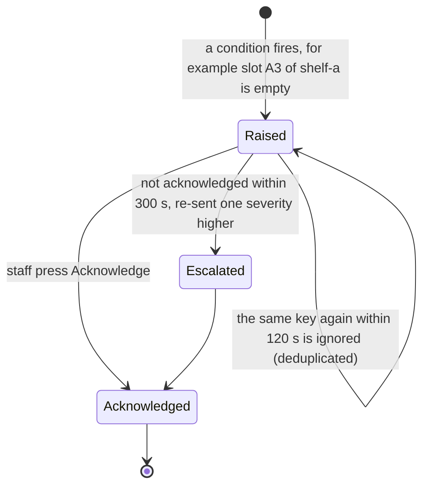

*Figure 3.6: The life of an alert.*

- **Keys and deduplication.** Every alert has a key such as `SLOT_EMPTY:shelf-a:A3`. The same key cannot fire again
  within `cooldown_s` (120 s).
- **Escalation.** An alert not acknowledged within `escalate_after_s` (300 s) is sent again one level higher (INFO →
  WARN → CRITICAL), marked "UNACKNOWLEDGED".
- **Outputs ("sinks").** Console, sound, spoken voice, and a tower light (the LED and buzzer on the STM32 board). A
  failing output is logged and ignored; a missing speaker must never stop the analytics.

**Status of outputs.** Console and sound: working. English voice through the offline speech library pyttsx3:
built. Hindi and Telugu voice use pre-recorded clips that have not been recorded yet (designed, not yet built). The
tower light depends on the serial bridge (in progress, chapter 4).

## 3.13 Health and tamper checks — Status: working and tested

**Health monitor (`health/monitor.py`).** Every 10 s it publishes a `HEALTH` event: frames per second per camera,
CPU use, memory, CPU temperature (read from the Pi's sensor), uptime and **video bytes stored**. The last is always 0,
because no code in the system opens a video writer; the dashboard shows it as proof.

**Camera tamper detector.** If a reference image of the camera's normal view is configured, every frame is compared
with it using two cheap measures that fail in different ways:

- **Brightness histogram correlation** detects covering (a hand, a cloth, lights off): the whole distribution changes.
- **Block-by-block structure** on an 8 × 8 grid of a small grey image detects moving the camera: the histogram
  stays almost the same, but the content shifts.

If the score stays below 0.55 for 3 frames in a row, the camera is marked tampered. Counting pauses for that camera
(its drawn lines no longer match the scene) and a CRITICAL alert is raised. Both measures run in well under a
millisecond on a Pi. The MEMS sensor on a camera bracket (section 3.8) adds a second, physical signal.

**Other health signals.** The stream watchdog (section 3.1.3) and the sensor-node heartbeat (chapter 4) publish
`CAMERA_HEALTH` and `NODE_HEALTH`.

## 3.14 Ask your store and the daily summary

### 3.14.1 Ask your store (`llm/ask.py`) — Status: working and tested (dashboard endpoint in progress)

**What it does.** Answers a question typed in plain words, such as "How many customers came in today?" or "Which
products are out of stock?", from the shop's own database.

**The one rule: the language model never supplies a number.**

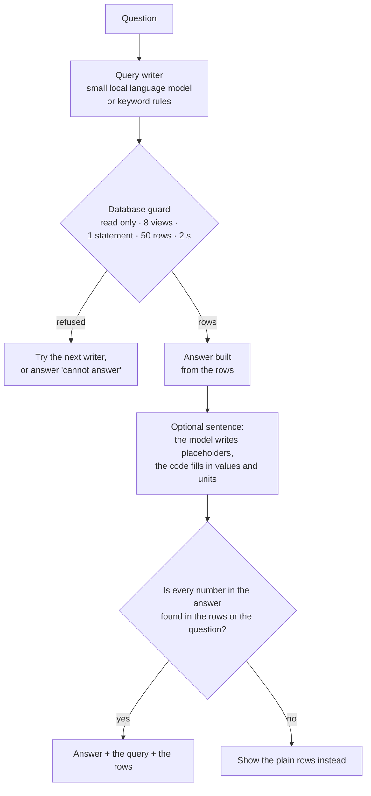

*Figure 3.7: How a question is answered.*

1. A small language model, **Qwen2.5-Coder 1.5B**, running locally through **Ollama** (a program that runs language
   models on the device), turns the question into one **SQL** database query. SQL is the standard language for asking
   a database questions. If the model is not installed or refuses, keyword rules try instead.
2. The query runs on a **read-only** connection that can see only eight prepared "views" (simple tables: entries,
   queue, services, slots, alerts, lost sales, picks, zone visits). SQLite's own permission check (the
   **authoriser**) refuses everything else: the raw tables, changes, attaching other files, loading extensions.
   This guard is in the database itself, so it does not depend on correctly reading the model's text.
3. The answer is built from the returned rows. If the model phrases a sentence, it may only write **placeholders**
   like `{customers_served}`. The code fills in the values and takes the unit from the column name (`_s` means
   seconds, `_inr` rupees).
4. A final check confirms that every number in the answer appears in the rows or in the question. Otherwise the plain
   rows are shown.
5. Every answer shows its query and rows. Answers from model-written queries carry a note: "check that the query asks
   what you meant".

**Results** [C]: 0 invented numbers in 60 test questions. On 20 questions nobody had seen before, 13 were answered
correctly and 7 wrongly (a correct number from the wrong query). This is why the query is always shown.

### 3.14.2 Daily summary (`llm/summary.py`) — Status: working and tested

A short daily report in English, Telugu and Hindi: visitors and the busiest hour, customers billed, average wait
and longest queue, empty and low shelves, estimated sales at risk, and alerts. It uses **no language model**: fixed
queries fill fixed sentence templates. A section with no data says "no data" rather than 0. The Telugu and Hindi
templates still need review by a native speaker.

**Limits.** The model runs in about 5 s per question on the laptop GPU; speed on the Pi is not measured. Hindi and
Telugu *questions* are only partly understood. The dashboard endpoints `/api/ask` and `/api/summary` are designed
but not yet added.

## 3.15 Configuration and calibration tools — Status: working and tested

**One configuration file per shop** (YAML, a simple text format) describes the cameras, lines, zones, counters,
shelves, sensors and thresholds. Nothing about a particular shop is written in the code.

- The file is checked with pydantic when loaded. An unknown key is an error, and a wrong value names the exact key,
  for example `cameras.0.fps: Input should be a valid number`.
- **Secrets** (camera and MQTT passwords) never go in this file. They come from `configs/secrets.yaml`, which git
  ignores, or from environment variables. A test fails if a secret-like file is committed.
- `docs/CONFIG_REFERENCE.md` lists every key with its type, default and meaning. A test fails if a key in the code is
  missing from that page.

**Calibration tool (`tools/calibrate.py`).** It shows a snapshot from the camera, and the installer clicks to draw:

| Key | Draw | Becomes |
|---|---|---|
| 1 | counting line (2 clicks) | the door line |
| 2 | zone (several clicks) | a dwell or promotion zone |
| 3 | queue lane | a counter lane |
| 4 | billing spot | the billing area |
| 5 | shelf slot (asks for SKU and price) | a shelf slot |
| 6 | floor plan (exactly 4 points) | the heatmap's floor mapping |

It also saves the camera's reference image for tamper detection. That image is the one picture the system keeps, so
it should be taken when nobody is in view.

**Other tools.** `tools/shelf_capture.py` and `tools/shelf_label.py` (collecting and labelling real shelf photos),
`tools/label_ground_truth.py` (marking true entries and queue events in a video, for evaluation) and
`tools/inventory.py` (lists available videos and models).

# 4. The hardware, part by part

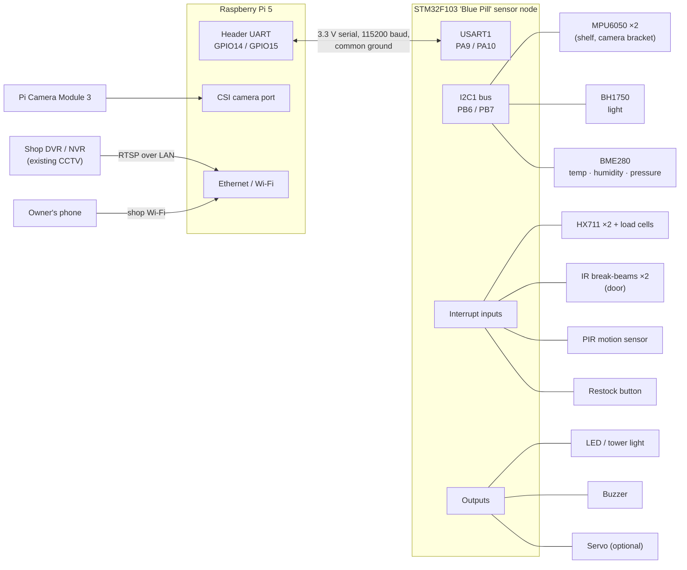

*Figure 4.1: Hardware overview. The Pi does all the vision work; the STM32 reads the sensors, decides simple things
fast, and sends short text lines to the Pi.*

**Why two computers?** The Pi is good at heavy work (neural networks, databases, web pages), but Linux cannot react
within microseconds and its pins are few and fragile. A microcontroller such as the STM32 reacts in microseconds,
counts beam timings precisely, reads weighing chips that need exact timing, and keeps working if the Pi restarts. The
two are joined by a single three-wire serial cable.

## 4.1 Raspberry Pi 5 (the edge box) — Status: designed, not yet built (Pi set-up; the board itself is available)

**Job.** Runs all the software in chapter 3: camera input, detection, tracking, analytics, fusion, database,
dashboard, and (optionally) the language model.

**Connections.** The Pi Camera Module 3 on the CSI port; the shop's DVR over Ethernet or Wi-Fi; the STM32 on the header
UART (GPIO14 = pin 8 transmit, GPIO15 = pin 10 receive, pin 6 ground); the owner's phone over the shop Wi-Fi.

**Setup plan** (in `docs/HARDWARE_TODO.md` and the build plan):

| Item | Plan | Status |
|---|---|---|
| Operating system | Raspberry Pi OS Bookworm 64-bit, Python 3.11 | Designed, not yet built |
| Power and cooling | official 27 W supply and the active cooler, so the CPU does not slow down when hot | Designed, not yet built |
| Header UART | enabled in `/boot/firmware/config.txt`, serial console off, fixed device name `/dev/storemind-mcu` through a udev rule | Designed, not yet built |
| Services | one **systemd** service per program, restarted automatically, with a watchdog heartbeat (`sd_notify`) | In progress (heartbeat helper on a branch) |
| Time | **chrony** as the time server for the DVR and the STM32; the Pi 5's real-time clock with its battery | Designed, not yet built |
| Speed test | `tools/bench_pi.py`: median and 95th-percentile inference time, FPS, temperature, throttling, power and energy per frame | Built, not yet run on the Pi |

The benchmark tool reads power from the Pi 5's power-management chip and corrects it with a published formula (real
power ≈ 1.1451 × PMIC reading + 0.5879 W), because the chip does not see every load.

## 4.2 STM32 sensor node and its FreeRTOS tasks — Status: in progress (firmware builds in CI on a branch; not yet run on a board)

**The board.** An **STM32F103C8 "Blue Pill"**: a small, cheap board with a 72 MHz ARM Cortex-M3 microcontroller,
64 KB of flash memory (for the program) and 20 KB of RAM.

**FreeRTOS.** The firmware uses **FreeRTOS**, a small real-time operating system. It runs several **tasks**
(independent loops) and switches between them by **priority**: when an urgent task has work, it runs before a less
urgent one. Tasks exchange data through **queues** (message boxes). This keeps, for example, the buzzer pattern
smooth while sensors are being read. The firmware follows the task plan in the hardware team's FreeRTOS guide, with
the MEMS task replacing an earlier distance-sensor task.

| Task | Priority | Stack | What it does |
|---|---|---|---|
| **Actuator** | highest (40) | 320 B | Runs LED and buzzer patterns every 20 ms and the servo; the buzzer switches itself off after 5 s. |
| **UART** | above normal (32) | 640 B | Owns the serial port: sends every outgoing line with the sequence counter; receives, checks and applies commands; answers each with `$K`. |
| **HX711** | normal+4 (28) | 384 B | When a weighing chip signals "sample ready" (interrupt), reads 24 bits, filters, and sends `$W` when the weight changes by more than 5 g, the stable flag changes, or 10 s pass. |
| **MEMS** | normal+2 (26) | 512 B | Reads two MPU6050 chips 100 times a second, runs the touch/knock/tilt state machine, and sends `$M`. A missing chip is searched for again every 5 s. |
| **Presence** | normal+2 (26) | 384 B | Timestamps IR-beam edges in microseconds and works out direction (`$B`, `$D`); PIR with 200 ms debounce (`$P`); restock button with 50 ms debounce and 1 s lockout (`$R`). |
| **Fusion/State** | normal (24) | 384 B | Forwards sensor events to the UART task; **weight gating**: while the shelf MEMS is between TOUCH and SETTLED, weights go out marked unstable. |
| **Environment** | below normal (16) | 512 B | BH1750 every 1 s; BME280 every 5 s; sends `$E`. A missing sensor gives an empty field. |
| **Health** | lowest (8) | 512 B | Resets the hardware watchdog **only if every other task has checked in**; blinks the heartbeat LED; sends `$H` every 10 s. |

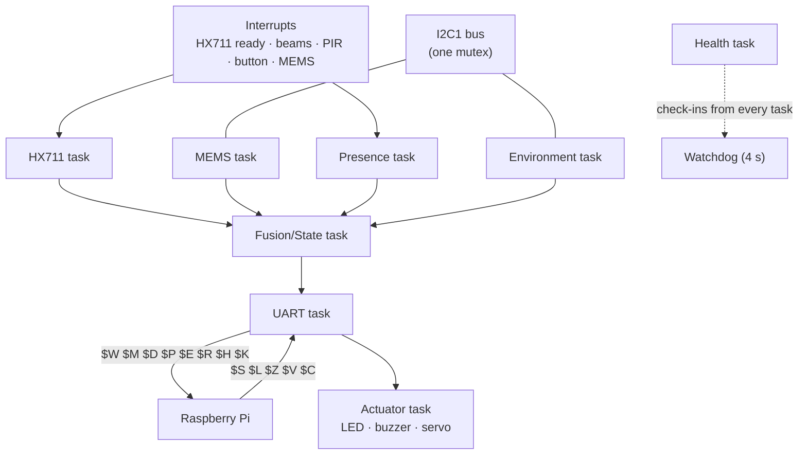

*Figure 4.2: Tasks and data paths inside the STM32. Arrows between tasks are FreeRTOS queues.*

**Design rules on the microcontroller:**

- **Events, not raw data.** The MEMS task samples 100 times a second but sends only short events (TOUCH, SETTLED,
  KNOCK, TILT). Raw samples would overflow both the serial line and the 20 KB of RAM.
- **Integers only.** All values are whole numbers with a stated scale (for example temperature × 10), because the
  small C library used on the board cannot print decimal numbers.
- **Every sensor can be removed twice:** at compile time (`app_config.h`) and at run time (`$C,ENABLE,<sensor>,0`).
  Settings such as tare, calibration and thresholds are saved in the last page of flash memory, protected by a
  CRC-16 checksum.
- **Memory budget.** The continuous-integration build fails if the program exceeds 60 KB of flash or 18 KB of RAM.
  Real stack use is reported in every `$H` heartbeat. If RAM runs out, the planned upgrade is the STM32F411 "Black
  Pill" (128 KB RAM, same tools).

**How it is tested without the board.** The protocol code and the decision logic are portable C, compiled and
tested on a PC. A script turns every example line in `docs/PROTOCOL.md` into test vectors, and a Python test fails if
they are out of date, so the C code, the Python code and the documentation cannot drift apart.

## 4.3 Each sensor and its job

Rule from the hardware team's guide: every sensor must resolve a doubt that another sensor cannot.

| Sensor | Connection | Its job | Status |
|---|---|---|---|
| **Load cell + HX711** (weighing sensor and its 24-bit converter), ×2 | PA0/PA1 and PA4/PA5, interrupt on data-ready | *How much* left the shelf: picks and put-backs in packs; deep-shelf fill | In progress |
| **MPU6050 MEMS accelerometer**, ×2 | I2C 0x68 (shelf) and 0x69 (camera bracket); interrupt on PB5 | *When* the shelf was touched, knocked or tilted; clean weight gating; camera bumped or moved | In progress |
| **IR break-beam pair** | PB12 (outer), PB13 (inner), 10–20 cm apart at hip height | *Exact* door crossing time and direction; cross-checks the camera count; takes over if the camera fails | In progress |
| **PIR motion sensor** (HC-SR501) | PB14 | Coarse presence: wakes the cameras in that zone; motion after closing time → intrusion alert | In progress |
| **BH1750 light sensor** | I2C 0x23 | Tells the shelf module whether a change is *lighting* or a real empty slot; "too dark → UNKNOWN" | In progress |
| **BME280** (temperature, humidity, pressure) | I2C 0x76 | Environment panel; box temperature; perishable-zone alerts (designed) | In progress |
| **LED / tower light** | PB8 (via transistor for a bright light) | Local alert light at the counter | In progress |
| **Buzzer** | PB9 via an NPN transistor | Local sound alert | In progress |
| **Restock button** | PB15 to ground | "Shelf refilled": the shelf module takes new reference photos | In progress |
| **Servo** (optional) | PA6 (timer PWM), own 5 V supply | Demonstration only (a mock gate or indicator) | In progress |
| **LD2450 radar** (optional) | PA2/PA3 (USART2) | Counting people at the counter through occlusion | Designed, not yet built (not purchased; not compiled) |
| **ESP32-S3 shelf camera** (optional) | Wi-Fi / MQTT | Cheap battery camera for shelves the CCTV cannot see | Designed, not yet built |

**How the MEMS state machine works** (per sensor, every 10 ms): read acceleration → remove the slowly changing
gravity part → measure the remaining vibration. Decisions are made per 50 ms window:

- vibration above the threshold that is still present after 150 ms → **TOUCH**; a hand lasts longer than a bump;
- quiet for 500 ms after a touch → **SETTLED**;
- a short strong spike that ends before 150 ms → **KNOCK**;
- gravity direction more than 5° (shelf) or 2° (camera) away from the direction at start-up, for 2 s → **TILT**.

Thresholds: 120 mg on a shelf and 600 mg on a camera bracket (mg = thousandths of the acceleration of gravity). They
can be changed with `$C,MEMS_THR` and are saved in flash. The real values must come from the shelf test in
`docs/HARDWARE_TODO.md`.

## 4.4 The serial message protocol — Status: specification final; Pi-side parser working and tested; bridge and firmware in progress

`docs/PROTOCOL.md` is the single source of truth. Both sides must match it, and tests on both sides parse every
example in it.

**The link.** USART1 on the STM32 (PA9 transmit, PA10 receive) to the Pi's header UART; 115,200 baud; 8 data bits,
no parity, 1 stop bit ("8N1"); 3.3 V logic on both sides; a common ground wire is mandatory.

**The line format (text mode).** Each message is one line of readable text, so it can be shown in a serial monitor:

```text
$<T>,<seq>,<ms>,<field>,<field>...*<XX>\r\n
$W,40,800000,A1,1840,1*3C          (slot A1 now weighs 1,840 g, stable)
```

| Part | Meaning |
|---|---|
| `$` | start of a line |
| `T` | one capital letter: the message type |
| `seq` | a counter 0–255 per direction. A jump means lines were lost; the Pi counts them. For commands, `seq` is the command number that `$K` echoes back. |
| `ms` | the sender's uptime in milliseconds; the Pi converts it to clock time |
| fields | comma-separated whole numbers with a fixed scale; an **empty field means "not measured"** |
| `*XX` | the **checksum**: the XOR of every byte between `$` and `*`, as two capital hex digits. A line with a wrong checksum is thrown away. |
| length | at most **96 bytes** including the line end; longer lines are dropped |

**Messages from the STM32 to the Pi**

| Line | Fields | Units | Sent when | Becomes event |
|---|---|---|---|---|
| `$W` | slot, grams, stable | g; stable 0/1 | weight changes by more than 5 g, and every 10 s | `WEIGHT` |
| `$M` | node, role, event, peak_mg, rms_mg, dur_ms, tilt_ddeg | role S = shelf, C = camera mount; event TOUCH / SETTLED / TILT / KNOCK; tilt in 0.1° | on each MEMS event | `SHELF_MOTION` or `CAMERA_MOUNT` |
| `$B` | beam_id, state | 0 = blocked, 1 = clear | every beam edge | none (debug log only) |
| `$D` | door, direction | IN / OUT, decided on the STM32 from the order the two beams broke | each crossing | `BEAM_CROSS` |
| `$P` | zone, active | 0/1 | on change | `PRESENCE` |
| `$E` | lux, temp×10, humidity×10, pressure×10 | lux; 0.1 °C; 0.1 %RH; 0.1 hPa | every 5 s | `ENVIRONMENT` |
| `$R` | shelf | — | restock button pressed | `SENSOR` (restock) |
| `$Q` | n, then x, y, speed for each target | mm, mm, cm/s | 10 times a second, only if the optional radar is enabled | `SENSOR` (radar) |
| `$H` | uptime_s, free_heap, min_stack_words, i2c_err, uart_err, reset_cause | seconds, bytes, words, counters, cause name | every 10 s | `NODE_HEALTH` |
| `$K` | cmd_seq, status, code | OK / ERR; 0 ok, 1 bad checksum, 2 unknown command, 3 bad argument, 4 sensor disabled, 5 busy | for every command received | command result |

**Commands from the Pi to the STM32**

| Line | Fields | Meaning |
|---|---|---|
| `$S` | epoch_ms | time sync, every 60 s and at connection |
| `$L` | pattern | LED: OFF, ON, SLOW, FAST, ALERT |
| `$Z` | pattern | buzzer, same patterns |
| `$V` | angle | servo angle 0–180° (optional) |
| `$C` | key, arguments | configuration: `TARE,slot` · `CAL,slot,grams` · `MEMS_THR,node,mg` · `MODE,TXT` or `MODE,BIN` · `ENABLE,sensor,0` or `ENABLE,sensor,1` |

The Pi resends a command up to **3 times** if no `$K` with the same number arrives within **200 ms**. Commands are
**idempotent** (doing one twice has the same effect as once), so a duplicate is harmless.

**Binary mode.** A compact, more robust format for production is prepared: **COBS** framing (a way of packing bytes so
that a zero byte always marks the end of a packet) with a **CRC-16** checksum. Both sides implement and test the
building blocks, but the per-message layout is not final, so the board answers `$C,MODE,BIN` with an error and stays
in text mode. Status: in progress.

## 4.5 Wiring and power — Status: in progress (pin map written; not yet checked on a real board)

| Function | STM32 pin | Connects to | Notes |
|---|---|---|---|
| UART to Pi | PA9 (TX) | Pi GPIO15, pin 10 (RX) | 115200 8N1, 3.3 V |
| UART from Pi | PA10 (RX) | Pi GPIO14, pin 8 (TX) | also the STM32's built-in serial bootloader port |
| Ground | GND | Pi pin 6 | **common ground is mandatory** |
| I2C clock / data | PB6 / PB7 | MEMS, BH1750, BME280 | 100 kHz; **one** set of 4.7 kΩ pull-up resistors for the whole bus |
| MEMS interrupt | PB5 | MPU6050 INT | motion interrupt |
| HX711 #1 | PA0 (data), PA1 (clock) | load cell for slot "1" | data falling edge = sample ready |
| HX711 #2 | PA4 (data), PA5 (clock) | load cell for slot "2" | |
| IR beam outer / inner | PB12 / PB13 | beam receivers | low = blocked; internal pull-up |
| PIR | PB14 | HC-SR501 output | check it outputs 3.3 V |
| Restock button | PB15 | button to ground | internal pull-up |
| Tower LED / buzzer | PB8 / PB9 | through a transistor | never drive a buzzer straight from a pin |
| Servo (optional) | PA6 | servo signal | own 5 V supply, grounds joined |
| Status LED | PC13 | on-board LED | blinks once a second when the Health task is alive |
| Programming | PA13 / PA14 | ST-Link (SWD) | for flashing firmware |

Every interrupt input uses a different interrupt line (0, 4, 5, 12, 13, 14, 15). On the F103 an interrupt line is
shared by the same pin number on every port, so, for example, PA0 and PB0 cannot both interrupt.

| Power rail | From | Feeds |
|---|---|---|
| 5 V | Pi 5 pins 2/4 or a USB supply | STM32 board, HX711, PIR, IR emitters |
| 3.3 V | STM32 board regulator | MEMS, BH1750, BME280, 3.3 V beam receivers |
| 5 V, separate | its own supply | servo (it draws spikes over 500 mA that would reset the microcontroller) |

Signals into the STM32 must be 3.3 V. Pins PA0–PA7 are **not** 5 V tolerant, so the HX711 must be powered from 3.3 V
or use 3.3 V logic.

**Load cells.** Each 4-wire load cell goes to its own HX711 (channel A, gain 128). After mounting: `$C,TARE,1` with the
slot empty, then `$C,CAL,1,500` with a known 500 g weight on it.

## 4.6 How the Pi and the STM32 stay reliable

| On the STM32 | On the Pi (serial bridge) |
|---|---|
| The watchdog resets the chip if any task stops checking in (4 s) | A bad checksum or broken line is dropped and counted |
| A locked I2C bus is released (up to 9 clock pulses, STOP, reset) and the transfer retried once | A sequence gap is counted as lost lines |
| A missing sensor gives an empty field and is searched for again later; nothing hangs | No heartbeat for 30 s: the link is marked down and a warning alert is raised |
| A bad or oversized command is refused with a `$K` error code | If the USB or serial port disappears, it is reopened with backoff (0.5 s up to 10 s) |
| Settings in flash are protected by a CRC-16 checksum | A command without an acknowledgement is resent up to 3 times |
| | Commands go through a queue, so the camera loop is never blocked |

*Table 4.1: Reliability measures on both sides of the serial link.*

- **Hardware watchdog.** If the firmware hangs, the STM32 resets itself within 4 s. The Health task resets the
  watchdog only when **every** task has checked in, so one stuck task is enough to trigger a reset.
- **I2C recovery.** The STM32F1's I2C hardware can lock up after an electrical glitch (a known issue in its errata
  sheet). All I2C access goes through one lock (**mutex**) so the MEMS and Environment tasks never collide, and a
  recovery routine frees a stuck bus. Every failure and recovery is counted in `$H`, so a loose cable shows on the
  dashboard before it becomes a dead sensor.
- **Timing.** The bridge converts the STM32's uptime to clock time using the smallest observed delay, because serial
  and USB buffering can only make a line look *late*, never early. A reboot (uptime going backwards) restarts this
  mapping.
- **Serial bridge on the Pi** (`sensors/bridge.py`, in progress on a branch): turns lines into events, sends
  commands, and applies all the Pi-side rules in Table 4.1. A **simulator** (`sensors/simulator.py`) plays a virtual
  STM32 over TCP with scenarios such as pick, put-back, trolley knock, camera tilt, lights off, after-hours, I2C fault
  and reboot, plus a "noisy cable" mode.
- **Hardware-in-the-loop test** (`tools/hil_test.py`, in progress): talks to the real board through the same bridge,
  checks every command's reply (including a deliberately corrupted line), measures command round-trip time, and runs
  a long framing test.

# 5. The Qualcomm path

The problem statement comes from Qualcomm, and Qualcomm's QCS6490 chip (used in the RUBIK Pi 3 and the Dragonwing
RB3 Gen 2 boards) has a **Hexagon NPU**: a processor built for neural networks, much faster and more power-efficient
than a CPU for this work. No QCS6490 board is available to the team, so the system uses **Qualcomm AI Hub**, a free
Qualcomm service that compiles a model and runs it on real Qualcomm devices in Qualcomm's lab.

## 5.1 Model compression (INT8) — Status: working and tested

Neural networks normally compute with 32-bit decimal numbers (**FP32**). **INT8 quantisation** converts them to
8-bit integers: the model becomes about four times smaller, and chips like the Hexagon NPU run integer maths far
faster. The conversion needs **calibration images** so that it can choose the right scale for each layer; the system
uses frames with people, CCTV angles and indoor light.

**A problem found and fixed.** YOLO's final output puts box coordinates (0 to 640 pixels) and class scores (0 to 1) in
one tensor. One 8-bit scale cannot represent both ranges well, so all scores became exactly zero and the first INT8
models detected nothing. The fix:

- for ONNX INT8, only the convolution layers are quantised and the output head stays in FP32;
- for AI Hub, the model's last step is cut so that `boxes` and `scores` are two separate outputs, each with its own
  scale. The host joins them again.

The first, failed run is kept as evidence (`qualcomm_aihub_run1_single_output.json`).

## 5.2 AI Hub results on the QCS6490 [Q]

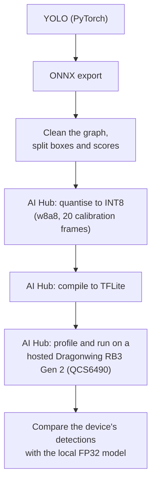

*Figure 5.1: The AI Hub workflow (`tools/aihub_profile.py`).*

| Model | Precision | Time per frame | Share of layers on the NPU | Peak memory | Detections vs local FP32 model |
|---|---|---|---|---|---|
| YOLO11n | FP32 | 150.9 ms | 5% | 66 MB | 29 of 29 identical |
| **YOLO11n** | **INT8** | **12.8 ms** | **100%** | **17 MB** | all found, precision 94% |
| YOLO26n | FP32 | 138.0 ms | 5% | 64 MB | 29 of 29 identical |
| YOLO26n | INT8 | 13.9 ms | 100% | 19 MB | all found, precision 94% |
| YOLO11s | FP32 | 239.3 ms | 5% | 108 MB | 30 of 30 identical |
| **YOLO11s** | **INT8** | **11.0 ms** | **100%** | 26 MB | all found, precision 86% |

*Table 5.1: Measured by Qualcomm AI Hub on a hosted Dragonwing RB3 Gen 2 (QCS6490) [Q]. These are Qualcomm's devices,
not the team's.*

What this shows:

- In FP32 almost nothing runs on the NPU, and the work falls to the slower GPU and CPU. In INT8 everything runs on the
  NPU, about 12 times faster, using a quarter of the memory.
- **YOLO11s**, which tracked people best but is too slow for the Pi's CPU, runs in 11.0 ms on the NPU. The better
  model is affordable only on the Qualcomm chip. This is a single AI Hub measurement and must be confirmed on a real
  board.
- INT8 finds every person the FP32 model finds but adds a few extra boxes (precision 86–94% on the sample frames).
  Counting must be re-checked with the INT8 model before it is used in a shop.
- For context only [P]: a published benchmark (consult.red, a different YOLO model and pipeline) reports 3.91 frames
  per second on a Raspberry Pi 5 CPU against 34.22 on a QCS6490 NPU, and 1,423 against 129 millijoules per frame.

## 5.3 Moving the system to a Qualcomm board — Status: built, not yet connected (runtime back-ends); designed, not yet built (board setup)

The port is small because almost nothing changes:

- **Same camera:** the RUBIK Pi 3 accepts the Raspberry Pi Camera Module 3.
- **Same 40-pin header:** the UART on pins 8 and 10 connects to the STM32 exactly as on the Pi 5.
- **Same code:** StoreMind is Python. Only the detector setting changes; tracking, analytics, fusion, database and
  dashboard are unchanged.

```yaml
detector:
  backend: litert_qnn                            # LiteRT + the QNN TFLite delegate
  model: ../models/yolo11n_aihub_w8a8.tflite     # the exact model AI Hub profiled
  qnn_lib: /usr/lib/libQnnTFLiteDelegate.so
  require_accelerator: true                      # refuse to start on the CPU
```

The alternative back-end `ort_qnn` uses ONNX Runtime with the QNN execution provider. The detector reports the
hardware it is really using, and `tools/bench_pi.py` compares NPU on and off: if the two times are equal, the NPU is
not being used.

**Designed, not yet built:** a zero-copy path using Qualcomm's IM SDK (GStreamer), where camera frames go straight to
the NPU without being copied through the CPU; the vendor operating-system image, services and time setup.

**Known pitfalls** (from the port guide, `deploy/qualcomm/README.md`): the NPU firmware must be loaded or the model
silently falls back to the CPU (the `accelerator` field catches this); the Qualcomm runtime and firmware versions must
match; the QCS6490 NPU needs INT8 models.

**First-day checklist with a board:** flash the vendor image; load the QNN delegate; run the benchmark with the NPU on
and off; run the demonstration with `require_accelerator: true`; measure power with an inline meter; move the numbers
from label Q to label S.

# 6. Privacy and security

## 6.1 What is never stored or done

| Never | How the code guarantees it | Status |
|---|---|---|
| Video or frames written to disk by the pipeline | Frames exist only in memory. No code in the system opens a video writer. The "video bytes stored" counter is 0 by construction and is shown on the dashboard. | Working and tested |
| Face recognition | There is no face model anywhere in the code. | Working and tested |
| Following a person across cameras or days | Tracking uses motion only; BoT-SORT runs without its appearance model; track numbers get a secret random offset each run. | Working and tested |
| Identifying staff | Only a yes/no "staff" flag per track; the badge number is thrown away after the check. | Working and tested |
| Audio | No microphone input anywhere. | Working and tested |
| Data leaving the shop | No cloud call in the pipeline; the language model runs on the device. A `sync_outbox` table exists for an optional head-office sync, but nothing sends it. | Working and tested |

## 6.2 What is stored

| Stored | Where | For how long | Can it contain a person's image? |
|---|---|---|---|
| Events (counts, times, zones, track numbers) | SQLite `events` table | 30 days by default, then deleted | No |
| Per-minute totals | SQLite `agg_minute` | kept | No |
| One reference image per camera (for tamper detection) | path in `cameras[].reference_frame` | until recalibration | **Possibly**: take it when nobody is in view |
| Shelf reference crops | `reference_dir` | until the next restock | Shelf slots only; taken only when no person overlaps the shelf |
| Floor heatmap | image file on request | overwritten | No: a colour map of totals |

The debug preview window (`--show`) is never saved, and it blurs every person before drawing. Tools that do write
images (demonstration clips from the public CAVIAR dataset, shelf photos for testing, synthetic scenes) are separate
programs that are never part of the running system, and git ignores videos and snapshots.

## 6.3 Security

- **Secrets** (camera, MQTT) live only in `configs/secrets.yaml` (ignored by git) or environment variables. The
  Qualcomm AI Hub token is kept only in Qualcomm's own client configuration. A test fails if a secrets file is
  tracked or staged in git, or if a tracked file contains something that looks like a real token.
- The generated go2rtc configuration contains camera passwords, so it is written to a git-ignored folder and never
  logged. Camera-health messages are checked not to contain passwords.
- The "Ask your store" query runs on a **read-only** database connection, with SQLite's own authoriser allowing only
  reads of eight prepared views.
- **Deployment rules** (from research/24 §8), to be carried out at installation (status: designed, not yet built):
  - a separate **read-only DVR account** with a strong unique password, sub-stream only, and the recording settings
    never changed;
  - **no port forwarding**; a private cable or VLAN to the DVR;
  - the Pi's firewall opens only the dashboard port to the shop network;
  - a one-page permission letter signed by the owner;
  - a notice at the entrance in English, Telugu and Hindi: "Anonymous footfall and queue analytics in use. No faces,
    no recordings.";
  - rotate passwords after a pilot.

**Legal note.** The design follows the intent of India's Digital Personal Data Protection Act, 2023: collect as little
as possible, store no identities, keep data local, and give notice. This document is not legal advice; a real
deployment should confirm the notice and consent wording with a qualified person.

**Limits.** The dashboard has no login yet: anyone on the shop Wi-Fi can open it. MQTT authentication depends on the
broker set-up, which is not built yet. Both are open problems (chapter 10).

# 7. How the system is tested and measured

## 7.1 The testing ladder

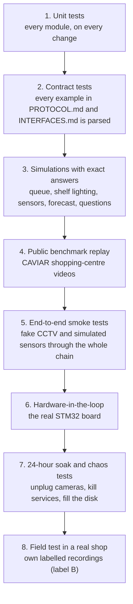

*Figure 7.1: From the cheapest test to the most realistic. Steps 1–5 run today; step 6 is in progress; steps 7 and 8
are designed, not yet done.*

- **Automated tests.** The Python test suite runs with `pytest`, and **ruff** checks code style. Both run on every pull
  request through GitHub Actions (continuous integration), together with the end-to-end camera smoke test. The
  firmware's C tests and the STM32 build are added to the same checks on the firmware branch (in progress).
- **Deterministic replay.** With recorded videos, one shared video clock always processes the camera whose next frame
  is earliest, so a replay gives exactly the same counts every time. Measurements can therefore be repeated.
- **Cached detections.** For the tracker comparison, the detector runs once per clip and its boxes are saved. Every
  variant replays the same boxes, so only the part being tested changes.

## 7.2 Keeping the test honest

A system can look perfect if its settings are tuned on the same data used to report results. Four rules prevent that:

1. **Tune on one part of the data, report on another.** On CAVIAR, settings are chosen on one camera view and scored
   on the other, and then the other way round (**2-fold cross-validation**). In simulations, seeds 1–10 are for
   tuning and seeds 11–40 are reported. For the question interface, three sets of 20 questions were written one after
   another, and the first run on the last set is the reported result.
2. **The correct answers are computed independently of the system.** Simulators write their own truth; CAVIAR
   crossings come from its published trajectories; question answers are computed in Python, not with SQL.
3. **A missed target stays visible.** The results file prints "Did not meet target" in the section itself.
4. **Every correction is published.** When a result on test data led to a change, both results are kept:

| Area | What happened | What was done |
|---|---|---|
| Counting | A first rule picked a tracker on a 0.002 difference (noise) | switched to cross-validation; both runs published |
| Speed | An early table mixed GPU and CPU timings | speed now forced to CPU and labelled |
| Shelf | A bug stopped the reference photos from updating | fixed; test seeds scored again (F1 0.93 → 0.92) |
| Queue | A small timing bias in balk detection | fixed; test seeds scored again (identical) |
| Qualcomm | The first INT8 models detected nothing | head split (section 5.1); failed run kept |
| Questions | Keyword rules overfitted; the grader missed "seconds" called "minutes" | a third, fresh question set; stricter grading applied to old runs (scores fell) |
| Labelling | A results row called the all-clips tuned setting (YOLO11s) "shipped" | relabelled; the Pi uses YOLO11n |

## 7.3 All current results

Every number in this section comes from `RESULTS.md`. The data label is shown in each table title. The measuring
laptop: Intel Core i5 HX (10 cores, 16 threads), 16.9 GB RAM, RTX 4050 GPU; speed was measured on the CPU only.

### Counting on the public CAVIAR benchmark [A]

CAVIAR is a set of 16 video clips (8 scenes × 2 camera views, 15.9 minutes, 111 annotated people) from a shopping
centre in Portugal, 384 × 288 pixels, with a sparse crowd. It is easier than a crowded kirana, and the small image
makes distant people harder to see.

| Configuration | Entries (true 30) | Exits (true 21) | Entry accuracy | Exit accuracy | Entry F1 | Exit F1 |
|---|---|---|---|---|---|---|
| Version 1: YOLO11n + ByteTrack + single line, fixed in advance | 33 | 24 | 90.0% | 85.7% | 0.89 | 0.76 |
| **Version 2 procedure, held out (cross-validated)** | 31 | 16 | **96.7%** | **76.2%** | 0.82 | 0.76 |

**The exit target (at least 90% on held-out data) is not met.** Settings tuned on one view scored 0.61–0.85 F1 on the
other view: they do not transfer. The detector mattered more than the tracker; the four trackers were within 0.02 IDF1
of each other on the corridor view.

### Counting on the synthetic entrance [C]

Perfect detections, so only the line logic is tested. The clip includes a person loitering on the line and two people
crossing shoulder to shoulder: entries 14 of 14, exits 6 of 6, mean crossing-time error 0.08 s, occupancy error 0.08
people.

### Queue [C]

| Engine | Queue length error (MAE) | Party error | Joins counted (true 833) | Median-wait error | Little's-law wait error | Walked away (true 95) |
|---|---|---|---|---|---|---|
| Version 1 | 0.38 | 0.85 | 2,598 | 2.7% | 53.1% | 0 |
| **Version 2** | **0.19** | **0.15** | **825** | 2.8% | 20.4% | 87 |
| Version 1, noisy tracking | 0.41 | 0.89 | 3,081 | 52.5% | 61.2% | 0 |
| **Version 2, noisy tracking** | **0.21** | **0.18** | **969** | 32.9% | 12.4% | 118 |

"Noisy" adds box jitter, 3% missed detections and 0.3 track-number switches per person per minute. On the synthetic
queue video with perfect detections, all 7 customers were found, the queue-length error was 0.06 people, the
waiting-time error 1.1% (0.39 s) and the median wait 39.9 s against 39.5 s true.

### Shelf under changing light [C]

| Engine | Slot-state accuracy | Empty-slot precision / recall / F1 | F1 day | F1 evening | F1 dim | Dark looks reported UNKNOWN |
|---|---|---|---|---|---|---|
| Version 1 | 54.7% | 0.98 / 0.59 / 0.74 | 0.91 | 0.15 | 0.33 | 0 of 714 |
| **Version 2 (with light sensor)** | **91.7%** | 0.97 / 0.88 / **0.92** | 0.91 | **0.93** | **0.89** | **714 of 714** |
| Version 2 (without light sensor) | 91.7% | 0.97 / 0.89 / 0.93 | 0.91 | 0.95 | 0.89 | 714 of 714 |

On the synthetic shelf video: slot-state accuracy 95.8%, empty-slot F1 1.00, 9 frames skipped because a person
blocked the shelf, and 0 false alerts while a shopper stood in front of it.

### Sensor fusion [C]

| Engine | Picks precision / recall / F1 | Put-backs precision / recall / F1 | False theft flags | Fallen packs caught (of 15) |
|---|---|---|---|---|
| Every reading counts (version 1) | 0.05 / 1.00 / 0.09 | not measured | 243 | 0 |
| Steady weight only | 0.66 / 0.66 / 0.66 | 0.54 / 0.61 / 0.57 | 0 | 0 |
| **MEMS-gated fusion** | **0.98 / 0.98 / 0.98** | **0.90 / 0.96 / 0.93** | **0** | **15** |

### Counter forecast [C]

Two synchronised 25-minute simulated clips (door and counter) with a built-in 6-minute shopping trip. The forecaster
was never told the delay.

| Measure | Result | Target |
|---|---|---|
| Delay learned / true | 6 min / 6.0 min | — |
| First "open another counter" warning | 480 s | — |
| Congestion actually starts | 1,000 s | — |
| **Warning lead time** | **8.7 minutes** | at least 3 minutes |
| Warnings / false alarms | 8 / 0 | 0 false alarms |

### Before and after, same perfect detections [C]

Given identical perfect detections on the synthetic entrance, the old counting code and the current one both count 14
of 14 entries and 6 of 6 exits. The old code's failures appear only with a real detector and real crowding (see the
CAVIAR results).

### Detector speed on the laptop CPU [S]

Real pedestrian video (OpenCV's `vtest.avi`), no correct answers, so speed only. Laptop timings change with
temperature and power state (the results file records the same measurement at 27 ms and 159 ms on different days),
so only rows from the same run are compared.

| Detector | Time per frame | Frames per second |
|---|---|---|
| YOLO11n, 320 px | 33.38 ms | 29.56 |
| YOLO11n, 416 px | 50.29 ms | 19.72 |
| YOLO11n, 640 px | 116.08 ms | 8.58 |
| YOLO26n, 640 px | 106.28 ms | 9.37 |
| EfficientDet-Lite0 (old system), 320 px | 21.38 ms | 45.83 |

### Exported model formats [S] and [A]

| Model and format | Size | Agreement with the FP32 model (recall / precision) [S] | Median time (4 CPU threads) [S] | CAVIAR entries / exits (true 30 / 21) [A] |
|---|---|---|---|---|
| YOLO11n PyTorch FP32 | 5.61 MB | 100.0% / 100.0% | 99.7 ms | 28 / 21 |
| YOLO11n ONNX FP32 | 10.74 MB | 100.0% / 100.0% | 29.8 ms | 28 / 21 |
| YOLO11n ONNX INT8 | 3.21 MB | 97.6% / 100.0% | 32.9 ms | 28 / 19 |
| YOLO11n NCNN FP32 | 10.66 MB | 100.0% / 100.0% | 52.3 ms | 28 / 21 |
| YOLO26n ONNX INT8 | 3.06 MB | 99.6% / 99.0% | 29.7 ms | 25 / 14 |

The CAVIAR counts in this table use settings tuned on those same clips, so they compare formats with each other and
are not an accuracy claim. FP32 exports give exactly the same counts as PyTorch; INT8 moves 2 to 4 crossings.

### Qualcomm QCS6490 [Q]

See Table 5.1: YOLO11n INT8 12.8 ms per frame with 100% of layers on the NPU.

### Ask your store [C]

| Query writer | Unseen set, first run (correct / wrong / refused) | Same set, current code | Invented numbers in 60 questions |
|---|---|---|---|
| Keyword rules only | 12 / 6 / 2 | 12 / 6 / 2 | 0 |
| Qwen2.5-Coder 1.5B only | 11 / 7 / 2 | 13 / 5 / 2 | 0 |
| **1.5B, then rules (default)** | **13 / 7 / 0** | 15 / 5 / 0 | **0** |
| Qwen2.5-Coder 3B, then rules | 12 / 8 / 0 | 14 / 6 / 0 | 0 |

The median time per question is about 5 s on the laptop GPU.

### Not measured yet

- **Label B is empty.** There is no labelled recording from a real shop or canteen, so real-world accuracy for
  doorway counting, queues and shelves is unknown.
- **Raspberry Pi 5:** no speed, power or temperature figures yet.
- **Sensor hardware:** no measurement on the real STM32 board, load cells or MEMS yet.
- **Qualcomm:** only Qualcomm's hosted devices; no board of the team's own.

# 8. What is new, compared with existing products and research

## 8.1 What already exists

| Category | Examples | What they do not cover |
|---|---|---|
| Shelf-audit AI for brands | Trax, ParallelDots ShelfWatch, Infilect | Photos taken by field staff or processed in the cloud; not continuous; priced for large brands |
| People counters | RetailNext-type sensors, CCTV vendor analytics | Counting only, usually with cloud dashboards; no link to shelves or queues |
| Predictive checkout staffing | Irisys (US patent 7,778,855, 2010), Xovis | Proven in large stores, but with dedicated overhead 3D or thermal sensors |
| Camera + weight inventory | Amazon patent US9996818B1; autonomous checkout (Amazon Just Walk Out, Zippin) | Many cameras and sensors, cloud-heavy, very expensive |
| One-photo planogram checks | Research on embedding-based compliance | Research prototypes, not tuned for small shops or changing light |
| Hackathon projects | YOLO plus a threshold | No forecasting, no fusion, no measured evidence |

## 8.2 What is different in StoreMind

The individual ideas are known. **Predictive staffing from door counts, for example, is not new** and is never
presented as new. What is different is the combination and where it runs:

1. **It uses the CCTV a shop already has**, with an estimated ₹15,000–25,000 box and no internet.
2. **Three signals are linked:** who enters, what happens at the shelves, and how long people wait to pay. The door
   count drives the queue forecast; shelf dwell at an empty slot drives the lost-sale estimate.
3. **The door-to-counter delay is learned automatically** by correlating two counts; no person is re-identified.
4. **Camera, weight and vibration are fused using a low-cost microcontroller**, separating picks, put-backs, touches,
   knocks and possible theft.
5. **The shelf method needs no training** and stays usable when the light changes, and it says "unknown" instead of
   guessing in the dark.
6. **Privacy can be checked, not just promised:** a live "video bytes stored: 0" counter, no face or appearance
   model, random track numbers, events only.
7. **The Qualcomm path is measured:** INT8 detection profiled on a real QCS6490 through AI Hub, with the fix that made
   INT8 work.
8. **Plain-language questions that cannot invent numbers:** the model only writes a guarded query, and the answer
   shows its evidence.
9. **Every number is labelled** by the kind of data behind it, and corrections are published.

# 9. Key design decisions

| Decision | Alternatives considered | Why this choice |
|---|---|---|
| **Raspberry Pi 5 CPU** as the edge box, Qualcomm NPU as the upgrade | NVIDIA Jetson, Hailo accelerator, cloud processing | Low cost and easy to obtain; the sponsor's chip is the planned upgrade; cloud processing breaks the offline and privacy goals |
| **Reuse existing CCTV** through sub-streams | Install new smart cameras | Shops already own cameras; sub-streams are light enough for a Pi |
| **Events on a bus** between modules | Modules calling each other directly | Parts can be swapped (replay vs live, simulator vs board) and tested alone |
| **MQTT** for multi-process messaging | HTTP calls, ZeroMQ, a custom socket | Standard in IoT, delivery levels per message, retained state, and "Last Will" liveness for free |
| **SQLite in WAL mode** | PostgreSQL, a cloud database | No server to run; one file; survives power cuts better; enough for one shop |
| **YOLO11n** detector | Larger YOLO models, SSD/EfficientDet | Best speed/size balance for the Pi; YOLO11s kept for the NPU |
| **ByteTrack, motion only** | BoT-SORT with appearance re-identification, DeepSORT | Cheap, and no appearance signature (privacy); chosen by a measured comparison |
| **Gate counter with confirmation** | Single line with a margin | Removes double counts from people hovering on the line |
| **Dwell-based queue joining** | "Anyone inside the lane polygon" | Passers-by tripled the arrival count and would mislead the forecast |
| **Erlang-C forecast with a learned delay** | Machine-learning forecast models | Explainable, needs no training data or history, and the delay adapts to each shop |
| **Reference-photo shelf method** | Train a product detector (SKU-110K) | Works on day one with any product and any shop; a detector remains an optional mode |
| **"UNKNOWN" state** | Always report FULL, LOW or EMPTY | A false "empty" alert costs the owner's trust faster than a missing reading |
| **STM32 microcontroller for sensors** | Wire sensors directly to the Pi; ESP32 | Exact timing for HX711 and beams, and it keeps working if the Pi restarts; the team already has it |
| **FreeRTOS with 8 tasks** | A single loop ("superloop") | Actuators stay responsive while sensors are read; priorities are explicit |
| **MEMS accelerometer** | Time-of-flight distance sensors; a microphone for UPI payment chimes | One chip gives touch timing, weight gating and camera-tamper detection; a microphone raises privacy questions |
| **Text serial protocol with checksum** (binary later) | Binary from the start | Readable in a serial monitor for debugging and demonstrations; binary is prepared for production |
| **INT8 with the output head split** | FP32 on the NPU; quantise everything together | FP32 barely uses the NPU; joint quantisation destroyed the scores |
| **Language model writes SQL only** | Let the model answer directly from data | A small model invents numbers; a guarded query plus verification cannot |
| **Daily summary from templates** | Generate it with the language model | Guaranteed correct numbers and exact translations; works without the model |

# 10. Current status, limitations and open problems

## 10.1 Status of every part

| Part | Status |
|---|---|
| Frame sources (file, USB, RTSP, Pi camera) and per-camera frame rate | Working and tested |
| Camera address templates, discover and probe tools, fake CCTV | Working and tested |
| go2rtc restream, stream watchdog, PIR wake-up (`IngestManager`) | Built, not yet connected |
| Motion gate, night-mode detection, ESP32-S3 shelf camera | Designed, not yet built |
| Person detector: PyTorch, ONNX, INT8, NCNN, LiteRT back-ends | Working and tested |
| Qualcomm QNN back-ends (`litert_qnn`, `ort_qnn`) | Built, not yet connected (no board) |
| Tracking with session-random track numbers | Working and tested |
| Door counting (gate counter), detection filters | Working and tested |
| IR-beam cross-check and fallback (Pi side) | Working and tested with simulated beam events |
| Staff exclusion (zones, ArUco badges) | Working and tested |
| Zone dwell and floor heatmap | Working and tested |
| Queue analysis | Working and tested |
| Counter forecast | Working and tested |
| Shelf monitoring (reference method, light handling, weight fusion) | Working and tested (simulation only) |
| Shelf detector / hybrid methods | Designed, not yet built (plumbing exists; no product detector trained) |
| Reorder drafts and lost-sale estimate | Working and tested |
| Sensor fusion (picks, put-backs, tamper, after-hours) | Working and tested (simulated sensor events) |
| Event schema, in-process bus, MQTT bus with Last Will | Working and tested |
| SQLite storage, per-minute totals, retention | Working and tested |
| Dashboard (page, REST API, WebSocket) | Working and tested |
| Dashboard camera, sensor and hardware panels; phone layout | Designed, not yet built |
| `/api/ask` and `/api/summary` endpoints | Designed, not yet built |
| Alerts: deduplication, escalation, console, sound, English voice | Working and tested |
| Hindi and Telugu voice clips | Designed, not yet built |
| Health monitor and camera tamper detection | Working and tested |
| Ask your store (language model + guard + verifier) | Working and tested (simulation) |
| Daily summary in English, Telugu and Hindi | Working and tested (translations need a native-speaker check) |
| Configuration validation, secrets handling, config reference test | Working and tested |
| Calibration and labelling tools | Working and tested |
| Model export tools and the Pi benchmark tool | Working and tested (benchmark not yet run on a Pi) |
| AI Hub profiling tool | Working and tested |
| Serial protocol: Pi-side parser and specification | Working and tested |
| Serial bridge and STM32 simulator | In progress (on a branch, not merged) |
| STM32 firmware (8 FreeRTOS tasks, I2C recovery, flash settings) | In progress (builds in CI on a branch; not run on a board) |
| Hardware-in-the-loop and MEMS test tools | In progress (on a branch) |
| Wiring and power plan | In progress (not yet checked on a real board) |
| Binary serial mode (COBS + CRC-16) | In progress (building blocks tested; layout not final) |
| LD2450 radar | Designed, not yet built (not purchased) |
| Pi 5 set-up: OS, UART, systemd services, chrony, install script | Designed, not yet built |
| 24-hour soak test and chaos tests | Designed, not yet built |
| Qualcomm board port (IM SDK zero-copy path, vendor image) | Designed, not yet built |
| POS / ERP integration, multi-store central view | Designed, not yet built (only the MQTT topic layout supports several stores) |

## 10.2 Known limitations

- **No real-shop data.** All shop-level results come from a public mall benchmark [A] or simulations [C].
- **Exit counting misses its target** (76.2% held out [A]), and settings do not transfer between camera views.
- **Per-person queue waits degrade with track switches** (32.9% error in noisy simulation [C]). Balks and reneges
  cannot be separated.
- **Simulators share assumptions with the modules they test.** The sensor simulator encodes the same model of the
  hardware as the fusion module, so its results show logical consistency, not hardware performance.
- **Small samples.** The CAVIAR front view has 18 crossings; each question set has 20 questions. One item moves a
  percentage by 5–12 points.
- **Speed is laptop-only.** No Raspberry Pi 5 figure exists yet.
- **The language model is right about two times in three** on unseen questions [C], and understands Hindi or Telugu
  questions only partly.
- **The dashboard has no login**, so anyone on the shop Wi-Fi can open it.
- **Database drops are not counted.** If the write queue ever fills, dropped events are not reported.
- **The YOLO models are AGPL-3.0 licensed**, which is fine for a hackathon or open demo; a closed commercial product
  needs an Ultralytics licence or a permissively licensed detector.

## 10.3 Open problems

1. How to reach 90% exit accuracy in real doorways: better camera placement, the IR beam as calibration, or a
   top-down camera.
2. How to keep per-person waiting times accurate under track switches, beyond stitching and Little's law.
3. Whether the shelf method holds up on real shelves with cluttered, similar-looking products.
4. Whether the Pi 5 CPU can run all cameras at the target rates, or whether the Qualcomm NPU is required.
5. Whether the sensor thresholds (MEMS 120 mg, weight noise 10 g) work on real shelves and real load cells.
6. How to connect a POS system to measure conversion directly instead of estimating it.

# 11. Questions for reviewers

Suggestions in these areas would help most:

1. **Door counting.** With a single camera over a shop door, what placement or method would you use to reach 90%
   exit accuracy? Is a top-down view worth the extra installation effort?
2. **Queue timing.** Is Little's law a sound cross-check for per-person waiting times in a small shop, where arrivals
   are not steady? Is there a better identity-free estimator?
3. **Forecast model.** Erlang-C assumes random arrivals and service. Would a simple simulation-based or data-driven
   model be more accurate for kiranas, without losing explainability?
4. **Shelf monitoring.** Which failure cases of the reference-photo method worry you most (similar packets,
   half-empty slots, reflections)? At what point is training a product detector worth it?
5. **Evaluation design.** Is the tune/report split strong enough? What would you add before trusting the simulation
   results (for example a second, independently written simulator)?
6. **Sensor fusion.** Are the MEMS thresholds and the "two agreeing readings" rule reasonable for HX711 load cells?
   What noise have you seen in practice?
7. **Firmware.** Is the 8-task FreeRTOS layout sensible on 20 KB of RAM? Would you merge tasks, or move to a larger
   microcontroller now?
8. **Serial protocol.** Is a text protocol with an XOR checksum acceptable for a shop installation, or should binary
   mode with CRC-16 be the default from the start?
9. **Security.** What is the minimum dashboard and MQTT security you would expect for a shop network?
10. **Privacy.** Is anything in the stored data (track numbers, zone visits, timestamps) still personal data in your
    view? Is the calibration snapshot handled well enough?
11. **Language interface.** How would you make a small local model write correct SQL more often without a bigger
    model: better prompts, examples, or a fixed menu of questions?
12. **Scaling.** What would you change to support many shops with a central view, while keeping each box offline-first?

# 12. How to install, run and reproduce

## 12.1 Install on a laptop (Windows or Linux)

```bash
git clone https://github.com/Vinith-44/SIH.git
cd SIH/storemind
python -m venv .venv
.venv/Scripts/python -m pip install -r requirements.txt        # Linux: .venv/bin/python
.venv/Scripts/python -m pytest -q                               # all tests should pass
```

Videos are not stored in git. Get the public CAVIAR clips with `download_caviar.ps1` and create the synthetic scenes
with `python tools/make_synthetic_video.py --out ../videos --scene all`. Install ffmpeg for the camera tools.

## 12.2 Run the demonstration (no camera, no network needed)

```bash
# replay three synthetic cameras at real speed, with the dashboard at http://localhost:8000/
.venv/Scripts/python -m storemind.run --config configs/demo.yaml --backend scripted --realtime --api \
    --start-time 2026-03-15T18:00:00+05:30 --db data/demo_stage.db

# daily summary in three languages from what was just recorded
.venv/Scripts/python -m storemind.llm.summary --db data/demo_stage.db --day 2026-03-15

# ask a question (uses the local model if Ollama has it, otherwise the keyword rules)
.venv/Scripts/python -m storemind.llm.ask --db data/demo_stage.db --today 2026-03-15 "How many people came in today?"

# the real detector on a real public clip, people blurred in the window
.venv/Scripts/python -m storemind.run --config configs/caviar.yaml --camera corridor --realtime --show
```

For the language model: install Ollama from ollama.com and run `ollama pull qwen2.5-coder:1.5b`.

## 12.3 Connect a real camera

1. Get written permission and a read-only DVR account.
2. `python tools/discover.py --subnet 192.168.1.0/24` to find recorders and cameras.
3. `python tools/probe.py "<rtsp address>" --expect-fps 8` to check the real frame rate and resolution.
4. `python tools/calibrate.py --source "<rtsp address>" --camera entrance` to draw lines, zones and slots.
5. Put the passwords in `configs/secrets.yaml`, never in the configuration file.

## 12.4 Reproduce the results

```bash
.venv/Scripts/python -m storemind.eval.run_all                  # regenerates RESULTS.md
.venv/Scripts/python -m storemind.eval.detcache                 # then: -m storemind.eval.bakeoff (CAVIAR)
.venv/Scripts/python -m storemind.eval.eval_queue_v2            # queue, seeds 11-40 (--grid tunes on 1-10)
.venv/Scripts/python -m storemind.eval.eval_shelf_lighting      # shelf under changing light
.venv/Scripts/python -m storemind.eval.eval_fusion              # MEMS + load-cell fusion
.venv/Scripts/python -m storemind.eval.eval_export --caviar      # exported model formats
.venv/Scripts/python -m storemind.eval.eval_ask                 # Ask your store
python tools/aihub_profile.py --models ../models/yolo11n.onnx --devices "Dragonwing RB3 Gen 2 Vision Kit"
python tools/bench_pi.py --models onnx:../models/yolo11n.onnx --frames 200     # on the Raspberry Pi 5
```

Each section of `RESULTS.md` prints the exact command that produced it.

## 12.5 Build this document

```bash
.venv/Scripts/python -m pip install playwright pypdf markdown-it-py
.venv/Scripts/python ../tools/build_docs_pdf.py
```

The script turns `docs/TECHNICAL_DOCUMENT.md` into `docs/StoreMind_Technical_Document.pdf`. It renders the diagrams,
numbers the pages and fills in the table of contents, using the Microsoft Edge browser that ships with Windows (no
browser download).

# 13. Glossary

| Term | Meaning |
|---|---|
| **A, B, C, S, Q, P** | Data labels that say what kind of data produced a number (see "How to read this document"). |
| **Accelerometer (MEMS)** | A tiny chip that measures acceleration: vibration, knocks and tilt. MEMS = micro-electro-mechanical system. |
| **ArUco marker** | A printed black-and-white square code that a camera can detect and read; used for staff badges. |
| **Authoriser (SQLite)** | A check inside the database that approves or refuses each operation a query tries to do. |
| **Backoff (exponential)** | Waiting longer after each failed retry (1 s, 2 s, 4 s ...) so a broken device is not flooded. |
| **Balk / renege** | Leaving at the queue without joining / leaving the queue before being served. |
| **Broker (MQTT)** | The small server that receives MQTT messages and passes them to subscribers (here Mosquitto). |
| **ByteTrack** | A tracking method that also uses low-confidence detections to keep following partly hidden people. |
| **CAVIAR** | A public set of shopping-centre videos with hand-marked people, used as a benchmark. |
| **Checksum (XOR)** | A small value computed from a message; if it does not match on arrival, the message was corrupted. |
| **CLAHE** | Contrast-limited adaptive histogram equalisation: boosts contrast region by region. |
| **COBS / CRC-16** | A byte-packing method that marks packet ends with a zero byte / a strong 16-bit error check. |
| **Cross-correlation** | Comparing two time series at different shifts to find the shift where they match best. |
| **Cross-validation (2-fold)** | Tune on half of the data, test on the other half, then swap. |
| **CSI** | The Raspberry Pi's ribbon-cable camera connector. |
| **Detection** | A box around an object found by the detector, with a confidence score. |
| **DVR / NVR** | The recorder that CCTV cameras connect to (analog / network cameras). |
| **Erlang-C** | A queueing formula giving the probability that a customer has to wait when there are c servers. |
| **Event** | A small typed message such as ENTRY or SLOT_STATE, passed between modules and stored in the database. |
| **F1 score** | A single accuracy figure combining precision and recall (2 × P × R ÷ (P + R)). |
| **Foot point** | The middle of the bottom edge of a person's box: roughly where they stand. |
| **FP32 / INT8** | 32-bit decimal numbers / 8-bit integers used inside a neural network. |
| **FPS** | Frames per second. |
| **FreeRTOS** | A small real-time operating system that runs several prioritised tasks on a microcontroller. |
| **go2rtc** | A small program that keeps one connection to each camera and shares the stream locally. |
| **HX711** | A 24-bit converter chip that reads a load cell. |
| **I2C** | A two-wire bus that connects several small sensors to a microcontroller. |
| **ID switch** | When a tracker gives two people each other's track numbers. |
| **IDF1** | A tracking score: how consistently one track number stays on one person. |
| **IoU** | Intersection over union: how much two boxes overlap (0 to 1). |
| **Kalman filter** | A method that predicts where a moving object will be next, from its past positions. |
| **Letterbox** | Resizing an image to a square without stretching, by adding padding. |
| **Little's law** | Average number waiting = arrival rate × average waiting time (L = λW). |
| **Load cell** | A weighing sensor that changes its electrical signal slightly under load. |
| **MAE** | Mean absolute error: the average size of the errors. |
| **Mermaid** | A text format for drawing diagrams; used for the figures in this document. |
| **MQTT** | A lightweight publish/subscribe messaging protocol common in IoT devices. |
| **Mutex** | A lock that lets only one task use a shared resource (here the I2C bus) at a time. |
| **NCNN** | A neural-network runtime optimised for ARM processors such as the Raspberry Pi's. |
| **Non-maximum suppression** | Removing duplicate, overlapping detections of the same object. |
| **NPU / Hexagon / HTP** | A processor built for neural networks; Qualcomm's is called Hexagon, its tensor unit HTP. |
| **Ollama** | A program that runs language models locally on a computer. |
| **ONNX** | A standard file format for neural networks that many runtimes can execute. |
| **Precision / recall** | Of the things reported, the share that were right / of the things that existed, the share found. |
| **pydantic** | A Python library that checks data against declared types. |
| **QNN / QAIRT** | Qualcomm's neural-network runtime (Qualcomm AI Engine Direct) and its SDK. |
| **QoS (MQTT)** | Quality of service: 0 = at most once, 1 = at least once. |
| **Quantisation** | Converting a model's numbers to a smaller type (for example INT8) to make it faster and smaller. |
| **Retained message** | An MQTT message the broker keeps and gives to anyone who subscribes later. |
| **RTSP** | Real Time Streaming Protocol: how CCTV recorders stream video over a network. |
| **SQL** | The standard language for querying a database. |
| **SQLite / WAL** | A single-file database / its write-ahead-log mode, which survives power cuts better. |
| **Sub-stream** | The small, low-resolution second stream a CCTV recorder provides. |
| **systemd** | The Linux service manager that starts programs at boot and restarts them if they crash. |
| **Track** | One person followed across frames, with a track number. |
| **UART** | A simple serial connection (transmit, receive, ground) between two chips. |
| **Watchdog** | A timer that resets a device if its software stops responding. |
| **WebSocket** | A connection kept open between a browser and a server so the server can push updates. |
| **YOLO** | "You Only Look Once": a family of fast object detectors. YOLO11n is its nano version. |
